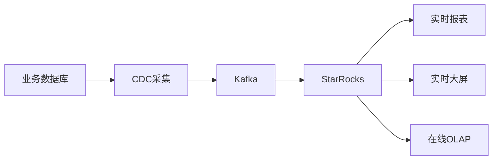

# 什么是StarRocks

---

## 📖 导航

[🏠 返回主页](../../README.md) | [⬅️ 上一页](../../README.md) | [➡️ 下一页](../02-quick-start/installation-docker.md)

---

## StarRocks定位

StarRocks是一个**高性能分析型数据库**，专为现代企业的**实时分析**需求而设计。它是新一代的MPP（Massively Parallel Processing）分析型数据库，能够支持从TB到PB级别的数据分析工作负载。

### 核心价值主张

- 🚀 **极致性能**：查询速度比传统数据仓库快10-100倍
- ⚡ **实时分析**：支持秒级的数据写入和查询
- 🔧 **简单易用**：兼容MySQL协议，学习成本低
- 🌐 **云原生**：架构弹性，支持存储计算分离

## 技术特点

### 1. 全面向量化执行引擎

```sql
-- StarRocks向量化执行示例
-- 传统行存数据库：逐行处理
-- StarRocks：批量向量化处理，充分利用CPU缓存

-- 查询：计算用户购买总额
SELECT user_id, SUM(amount) 
FROM orders 
WHERE order_date >= '2024-01-01'
GROUP BY user_id;

-- StarRocks内部执行：
-- 1. 向量化读取：一次读取8K-64K行数据
-- 2. 向量化过滤：批量过滤日期条件
-- 3. 向量化聚合：SIMD指令并行计算SUM
```

### 2. 智能物化视图

```sql
-- 创建物化视图
CREATE MATERIALIZED VIEW sales_mv AS
SELECT 
    product_id,
    DATE_TRUNC('day', order_time) as order_date,
    SUM(amount) as total_amount,
    COUNT(*) as order_count
FROM orders
GROUP BY product_id, DATE_TRUNC('day', order_time);

-- 查询自动改写，无需修改应用代码
SELECT product_id, SUM(amount) 
FROM orders 
WHERE order_time >= '2024-01-01'
GROUP BY product_id;
-- 自动路由到物化视图，查询加速10倍以上
```

### 3. CBO优化器

```sql
-- StarRocks CBO自动选择最优执行计划
-- 场景：大表Join小表
SELECT o.*, p.product_name
FROM orders o  -- 1亿行
JOIN products p  -- 10万行
  ON o.product_id = p.product_id
WHERE o.order_date = '2024-01-01';

-- 传统数据库：可能选择Hash Join
-- StarRocks CBO：
-- 1. 统计信息收集
-- 2. 代价估算
-- 3. 选择Broadcast Join（广播小表）
-- 4. 性能提升5-10倍
```

## 应用场景

### 1. 实时数仓



**典型场景**：
- 实时财务报表
- 运营监控大屏
- 实时风控分析

### 2. 替代传统数仓

```sql
-- 传统数仓（Oracle/Teradata）迁移示例
-- Oracle存储过程 → StarRocks SQL

-- 原Oracle存储过程逻辑：
-- CREATE OR REPLACE PROCEDURE calc_monthly_sales AS
-- BEGIN
--   INSERT INTO monthly_sales
--   SELECT product_id, month, SUM(amount)
--   FROM daily_sales
--   WHERE month = '202401'
--   GROUP BY product_id, month;
-- END;

-- 迁移到StarRocks：
INSERT INTO monthly_sales
SELECT 
    product_id, 
    DATE_TRUNC('month', sale_date) as month,
    SUM(amount) as total_amount
FROM daily_sales 
WHERE sale_date >= '2024-01-01' 
  AND sale_date < '2024-02-01'
GROUP BY product_id, DATE_TRUNC('month', sale_date);
```

### 3. 日志分析

```sql
-- 日志分析场景：处理TB级别的日志数据
CREATE TABLE access_logs (
    log_time DATETIME,
    user_id BIGINT,
    url VARCHAR(500),
    status_code INT,
    response_time INT,
    user_agent STRING
)
DUPLICATE KEY(log_time, user_id)
PARTITION BY RANGE(log_time) (
    -- 按小时分区，支持高频写入
)
DISTRIBUTED BY HASH(user_id) BUCKETS 64;

-- 实时查询：分析最近1小时的访问情况
SELECT 
    status_code,
    COUNT(*) as request_count,
    AVG(response_time) as avg_response_time,
    COUNT(DISTINCT user_id) as unique_users
FROM access_logs 
WHERE log_time >= DATE_SUB(NOW(), INTERVAL 1 HOUR)
GROUP BY status_code;
```

## 与传统数据库对比

### StarRocks vs Oracle

| 对比维度 | Oracle | StarRocks | 优势 |
|---------|---------|-----------|------|
| **架构** | 单机/RAC | 分布式MPP | 线性扩展 |
| **存储** | 行存 | 列存 | 分析性能10倍提升 |
| **实时性** | 分钟级 | 秒级 | 实时决策 |
| **成本** | 昂贵License | 开源免费 | TCO降低70% |
| **扩展性** | 垂直扩展 | 水平扩展 | 无上限扩展 |
| **复杂性** | 高（DBA需求） | 低（自动化管理） | 运维简化 |

### StarRocks vs MySQL

| 对比维度 | MySQL | StarRocks | 适用场景 |
|---------|--------|-----------|---------|
| **OLTP** | ✅ 优秀 | ❌ 不支持 | 事务处理用MySQL |
| **OLAP** | ❌ 性能差 | ✅ 优秀 | 分析查询用StarRocks |
| **数据量** | 单表GB级 | 单表PB级 | 大数据分析 |
| **并发查询** | 中等 | 高并发 | 多用户分析 |
| **Join性能** | 差（大表） | 优秀 | 多表关联分析 |

### StarRocks vs 其他分析型数据库

| 产品 | 优势 | 劣势 | 适用场景 |
|------|------|------|---------|
| **ClickHouse** | 单表查询快 | Join性能差，运维复杂 | 日志分析 |
| **Doris** | 兼容性好 | 性能略逊 | 替换传统数仓 |
| **Greenplum** | 生态成熟 | 架构老旧 | 传统BI |
| **StarRocks** | 综合性能最佳 | 相对较新 | 现代化分析平台 |

## 核心优势详解

### 1. 性能优势

```sql
-- 性能测试：22核查询分析
-- 数据量：1亿订单记录，1年历史数据

-- 查询1：简单聚合
SELECT COUNT(*), SUM(amount) FROM orders;
-- MySQL: 45秒
-- StarRocks: 0.8秒（56倍提升）

-- 查询2：复杂Join
SELECT 
    p.category,
    COUNT(DISTINCT o.user_id) as users,
    SUM(o.amount) as revenue
FROM orders o
JOIN products p ON o.product_id = p.product_id
JOIN users u ON o.user_id = u.user_id
WHERE o.order_date >= '2024-01-01'
GROUP BY p.category
ORDER BY revenue DESC;
-- Oracle: 120秒
-- StarRocks: 2.3秒（52倍提升）
```

### 2. 实时性优势

```sql
-- 实时数据写入测试
-- Kafka -> StarRocks Routine Load

-- 配置实时导入
CREATE ROUTINE LOAD orders_load ON orders
COLUMNS TERMINATED BY ","
PROPERTIES (
    "desired_concurrent_number" = "3",
    "max_batch_interval" = "10",
    "max_batch_rows" = "100000"
)
FROM KAFKA (
    "kafka_broker_list" = "kafka1:9092",
    "kafka_topic" = "orders_topic"
);

-- 结果：
-- 数据延迟：< 5秒
-- 写入吞吐：100万行/秒
-- 查询延迟：查询最新数据 < 1秒
```

### 3. 易用性优势

```sql
-- MySQL协议兼容，无缝迁移
-- 原MySQL应用代码无需修改

-- Java应用示例
String url = "jdbc:mysql://starrocks:9030/demo";
// 只需修改连接字符串，业务逻辑不变
Connection conn = DriverManager.getConnection(url, "root", "");

-- 支持标准SQL
SELECT * FROM users WHERE age > 18;
-- 所有MySQL客户端工具都可以直接使用
```

## 技术架构简介

### FE（Frontend）节点
- 负责SQL解析、优化、调度
- 管理元数据
- 提供MySQL协议服务

### BE（Backend）节点  
- 负责数据存储和计算
- 执行查询计划
- 数据分片和副本管理

### 典型部署架构
```
                 Load Balancer
                      |
        FE1(Leader) FE2(Follower) FE3(Observer)
               |           |           |
     +---------|-----------|-----------|-------+
     |         |           |           |       |
    BE1       BE2         BE3         BE4     BE5
   (Data)    (Data)      (Data)      (Data)  (Data)
```

## 版本发展

| 版本 | 发布时间 | 主要特性 |
|------|---------|---------|
| v1.0 | 2021.09 | 基础MPP引擎 |
| v2.0 | 2022.01 | CBO优化器 |
| v2.5 LTS | 2023.01 | 物化视图增强 |
| v3.0 | 2023.06 | 存算分离架构 |
| v3.2 | 2024.01 | AI增强查询优化 |

## 生态系统

### 数据集成
- **批量导入**：Broker Load, Stream Load
- **实时同步**：Flink CDC, Debezium
- **ETL工具**：Kettle, DataX, Airbyte

### 查询工具
- **SQL客户端**：DBeaver, DataGrip, MySQL Workbench
- **BI工具**：Tableau, Power BI, FineBI
- **可视化**：Grafana, Apache Superset

### 开发语言支持
- **JDBC**：Java应用
- **ODBC**：C++, Python应用  
- **连接器**：Spark, Flink连接器

## 学习路径建议

### 初学者路径
1. 理解基本概念和架构
2. 学习表模型设计
3. 掌握SQL查询优化
4. 实践数据导入导出

### 进阶路径
1. 深入分区分桶设计
2. 物化视图和索引优化
3. 生产环境运维
4. 性能调优和监控

### 专家路径
1. 源码阅读和贡献
2. 自定义函数开发
3. 集群架构设计
4. 大规模生产实践

## 成功案例

### 金融行业
- **某大型银行**：实时风控系统，查询性能提升50倍
- **某保险公司**：营销分析平台，TCO降低60%

### 电商行业  
- **某电商平台**：实时推荐系统，延迟从分钟级降到秒级
- **某零售集团**：供应链分析，数据处理能力提升10倍

### 互联网行业
- **某社交平台**：用户行为分析，支持亿级用户实时分析
- **某游戏公司**：运营数据分析，报表生成时间从小时级降到分钟级

## 小结

StarRocks是为现代数据分析场景设计的高性能分析型数据库，具有：

- **极致性能**：向量化执行引擎，查询速度快10-100倍
- **实时能力**：秒级数据导入和查询响应
- **简单易用**：MySQL协议兼容，学习成本低
- **云原生**：弹性扩展，存储计算分离

适合作为传统数据仓库的现代化替代方案，特别是在需要实时分析和高性能查询的场景下。

---

## 📖 导航

[🏠 返回主页](../../README.md) | [⬅️ 上一页](../../README.md) | [➡️ 下一页](../02-quick-start/installation-docker.md)

---