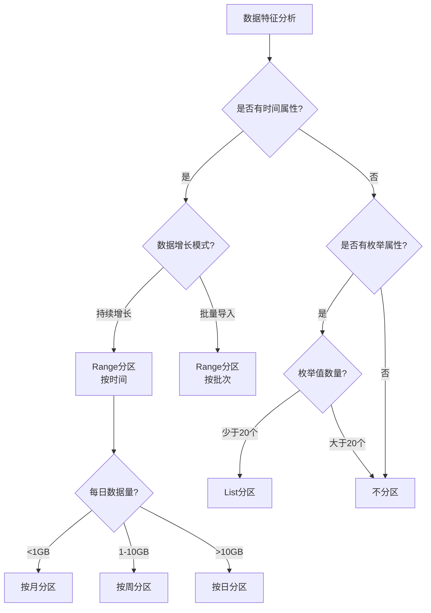

# StarRocks分区策略设计

---

## 📖 导航

[🏠 返回主页](../../README.md) | [⬅️ 上一页](table-models.md) | [➡️ 下一页](bucket-design.md)

---

## 学习目标

- 理解StarRocks分区的原理和作用
- 掌握Range、List和表达式分区三种类型的使用
- 学会设计合理的分区策略
- 了解动态分区和表达式分区的配置和管理
- 重点掌握表达式分区的强大功能（**v3.1+**新特性）
- 了解自动分区管理（**v3.0+**新特性）

## 分区概述

### 什么是分区

分区是将表按照某个维度（通常是时间）划分成多个独立的数据片段。每个分区在物理上是独立存储的，可以独立管理和查询。

### 分区类型版本支持

| 分区类型 | 支持版本 | 主要特性 | 推荐场景 |
|---------|---------|---------|---------|
| **Range分区** | v1.0+ | 连续范围值分区，最基础的分区方式 | 时间序列数据 ✅ |
| **List分区** | v2.0+ | 枚举值分区，离散值场景 | 地区、类型分区 ✅ |
| **动态分区** | v1.0+ | 自动创建和删除分区 | 时间序列自动化运维 ✅ |
| **表达式分区** | **v3.1+** 🔥 | 基于函数表达式的自动分区 | 复杂分区需求 ⭐ |
| **自动分区** | **v3.0+** 🔥 | 数据导入时自动创建分区 | 零运维分区管理 ⭐ |

### 分区的优势

- 🚀 **查询加速**：通过分区裁剪减少扫描数据量
- 📊 **生命周期管理**：方便按分区删除历史数据
- 🔧 **运维便利**：可以按分区进行备份、恢复、迁移
- ⚡ **并行处理**：不同分区可以并行导入和查询
- 🤖 **自动化运维**：v3.0+支持自动分区管理（表达式分区、自动分区）

## Range分区

### 概念说明

Range分区是最常用的分区方式，按照**连续的范围值**划分数据。最典型的应用是按时间分区。

### 分区粒度选择

| 数据特征 | 建议粒度 | 分区大小目标 | 示例场景 |
|---------|---------|-------------|---------|
| 每日数据量<1GB | 按月分区 | 10-50GB | 小型业务系统 |
| 每日数据量1-10GB | 按周分区 | 10-100GB | 中型交易系统 |
| 每日数据量10-100GB | 按日分区 | 10-100GB | 大型电商平台 |
| 每日数据量>100GB | 按小时分区 | 10-50GB | 实时日志系统 |

### 建表示例

#### 1. 按日分区（最常用）

```sql
-- 订单表：按日分区
CREATE TABLE IF NOT EXISTS orders_daily (
    order_id BIGINT NOT NULL,
    user_id BIGINT NOT NULL,
    product_id BIGINT NOT NULL,
    order_time DATETIME NOT NULL,
    amount DECIMAL(10,2) NOT NULL,
    status VARCHAR(20) NOT NULL
)
DUPLICATE KEY(order_id, order_time)
PARTITION BY RANGE(order_time) (
    -- 静态分区定义
    PARTITION p20240101 VALUES [('2024-01-01 00:00:00'), ('2024-01-02 00:00:00')),
    PARTITION p20240102 VALUES [('2024-01-02 00:00:00'), ('2024-01-03 00:00:00')),
    PARTITION p20240103 VALUES [('2024-01-03 00:00:00'), ('2024-01-04 00:00:00')),
    -- 可以预创建未来分区
    PARTITION p20240104 VALUES [('2024-01-04 00:00:00'), ('2024-01-05 00:00:00'))
)
DISTRIBUTED BY HASH(order_id) BUCKETS 10;

-- 添加新分区
ALTER TABLE orders_daily ADD PARTITION p20240105 
VALUES [('2024-01-05 00:00:00'), ('2024-01-06 00:00:00'));

-- 删除历史分区
ALTER TABLE orders_daily DROP PARTITION p20240101;

-- 查看分区信息
SHOW PARTITIONS FROM orders_daily;
```

#### 2. 按月分区

```sql
-- 销售汇总表：按月分区
CREATE TABLE IF NOT EXISTS sales_monthly (
    stat_date DATE NOT NULL,
    product_id BIGINT NOT NULL,
    total_amount DECIMAL(15,2) NOT NULL,
    order_count BIGINT NOT NULL
)
DUPLICATE KEY(stat_date, product_id)
PARTITION BY RANGE(stat_date) (
    PARTITION p202401 VALUES [('2024-01-01'), ('2024-02-01')),
    PARTITION p202402 VALUES [('2024-02-01'), ('2024-03-01')),
    PARTITION p202403 VALUES [('2024-03-01'), ('2024-04-01')),
    PARTITION p202404 VALUES [('2024-04-01'), ('2024-05-01'))
)
DISTRIBUTED BY HASH(product_id) BUCKETS 10;
```

#### 3. 按小时分区（高频数据）

```sql
-- 实时日志表：按小时分区
CREATE TABLE IF NOT EXISTS app_logs_hourly (
    log_time DATETIME NOT NULL,
    user_id BIGINT,
    action VARCHAR(50),
    params TEXT
)
DUPLICATE KEY(log_time, user_id)
PARTITION BY RANGE(log_time) (
    PARTITION p2024010100 VALUES [('2024-01-01 00:00:00'), ('2024-01-01 01:00:00')),
    PARTITION p2024010101 VALUES [('2024-01-01 01:00:00'), ('2024-01-01 02:00:00')),
    PARTITION p2024010102 VALUES [('2024-01-01 02:00:00'), ('2024-01-01 03:00:00'))
    -- 通常配合动态分区自动创建
)
DISTRIBUTED BY HASH(user_id) BUCKETS 10;
```

### 动态分区

动态分区可以**自动创建和删除分区**，无需手动管理。

```sql
-- 创建支持动态分区的表
CREATE TABLE IF NOT EXISTS orders_dynamic (
    order_id BIGINT NOT NULL,
    user_id BIGINT NOT NULL,
    order_time DATETIME NOT NULL,
    amount DECIMAL(10,2) NOT NULL
)
DUPLICATE KEY(order_id, order_time)
PARTITION BY RANGE(order_time) ()  -- 初始不创建分区
DISTRIBUTED BY HASH(order_id) BUCKETS 10
PROPERTIES (
    -- 开启动态分区
    "dynamic_partition.enable" = "true",
    
    -- 分区时间单位：DAY, WEEK, MONTH, YEAR
    "dynamic_partition.time_unit" = "DAY",
    
    -- 保留最近30天的分区
    "dynamic_partition.end" = "3",
    
    -- 提前创建未来3天的分区
    "dynamic_partition.prefix" = "p",
    
    -- 分区名前缀
    "dynamic_partition.buckets" = "10",
    
    -- 保留历史分区数量
    "dynamic_partition.history_partition_num" = "30",
    
    -- 开始日期（可选）
    "dynamic_partition.start" = "-30",
    
    -- 创建分区的起始偏移
    "dynamic_partition.create_history_partition" = "true"
);

-- 查看动态分区配置
SHOW CREATE TABLE orders_dynamic;

-- 修改动态分区配置
ALTER TABLE orders_dynamic SET (
    "dynamic_partition.end" = "7",
    "dynamic_partition.history_partition_num" = "60"
);
```

### 分区裁剪优化

```sql
-- 好的查询：能够进行分区裁剪
EXPLAIN SELECT * FROM orders_daily 
WHERE order_time >= '2024-01-01' 
  AND order_time < '2024-01-02';
-- 只扫描 p20240101 分区

-- 差的查询：无法分区裁剪
EXPLAIN SELECT * FROM orders_daily 
WHERE DATE_FORMAT(order_time, '%Y-%m') = '2024-01';
-- 扫描所有分区，因为使用了函数

-- 优化后的查询
EXPLAIN SELECT * FROM orders_daily 
WHERE order_time >= '2024-01-01' 
  AND order_time < '2024-02-01';
-- 只扫描1月份的分区
```

## 表达式分区（v3.1+新特性）🔥

### 概念说明

表达式分区是StarRocks 3.1+引入的**新一代分区功能**，支持使用**函数表达式**作为分区列，实现自动化分区管理。相比传统的手动分区，表达式分区具有更高的灵活性和自动化程度。

### 版本演进

| 版本 | 功能特性 | 说明 |
|------|---------|------|
| **v3.0** | 自动分区基础支持 | 数据导入时自动创建分区 |
| **v3.1** | 表达式分区正式发布 | 支持复杂函数表达式分区 |
| **v3.1.4** | STRING分区键转换 | 支持STRING类型分区键转DATE |
| **v3.2** | 性能优化 | 表达式计算性能大幅优化 |
| **v3.5** | 分区管理增强 | 支持批量分区删除和TTL |

### 核心优势

| 特性 | 表达式分区 | 传统分区 | 优势 |
|------|-----------|---------|------|
| **自动创建** | 数据导入时自动创建 | 需要手动预创建 | 零维护 |
| **函数支持** | 支持时间函数、转换函数 | 仅支持原始列 | 更灵活 |
| **多列组合** | 支持多列、多函数组合 | 单列或简单组合 | 功能强大 |
| **数据类型** | 支持STRING转DATE等转换 | 数据类型受限 | 适应性强 |

### 支持的分区表达式

#### 1. 时间函数分区

```sql
-- 1.1 按天分区（最常用）
PARTITION BY date_trunc('day', event_time)

-- 1.2 按周分区（7天为一个分区）
PARTITION BY time_slice(event_time, INTERVAL 7 day)

-- 1.3 按月分区
PARTITION BY date_trunc('month', event_time)

-- 1.4 按年分区
PARTITION BY date_trunc('year', event_time)

-- 1.5 按小时分区（实时场景）
PARTITION BY date_trunc('hour', event_time)
```

#### 2. 时间戳转换分区

```sql
-- 2.1 Unix时间戳转日期（10位秒级）
PARTITION BY from_unixtime(ts, '%Y%m%d')

-- 2.2 毫秒时间戳转日期（13位毫秒级）
PARTITION BY from_unixtime_ms(ts_ms, '%Y%m%d')

-- 2.3 整数时间戳转月份
PARTITION BY date_trunc('month', str_to_date(CAST(ts as STRING), '%Y%m%d'))
```

#### 3. 字符串转日期分区

```sql
-- 3.1 字符串日期转分区
PARTITION BY str2date(date_str, '%Y-%m-%d')

-- 3.2 复杂格式转换
PARTITION BY str_to_date(datetime_str, '%Y/%m/%d %H:%i:%s')
```

#### 4. 多列组合分区

```sql
-- 4.1 时间+地区组合
PARTITION BY date_trunc('day', event_time), region

-- 4.2 日期+业务线组合  
PARTITION BY str2date(date_str, '%Y-%m-%d'), business_type

-- 4.3 时间函数+列值组合
PARTITION BY from_unixtime(ts, '%Y%m%d'), city
```

### 建表示例

#### 1. 基础表达式分区

```sql
-- 用户行为表：自动按天分区
CREATE TABLE IF NOT EXISTS user_behavior (
    event_time DATETIME NOT NULL COMMENT "事件时间",
    user_id BIGINT NOT NULL COMMENT "用户ID", 
    event_type VARCHAR(50) NOT NULL COMMENT "事件类型",
    page_url VARCHAR(500) COMMENT "页面URL",
    user_agent TEXT COMMENT "用户代理",
    ip_address VARCHAR(50) COMMENT "IP地址"
)
DUPLICATE KEY(event_time, user_id)
-- 使用表达式分区：自动按天创建分区
PARTITION BY date_trunc('day', event_time)
DISTRIBUTED BY HASH(user_id) BUCKETS 32;

-- 插入数据：自动创建对应分区
INSERT INTO user_behavior VALUES
('2024-01-15 10:30:00', 1001, 'page_view', '/home', 'Chrome', '192.168.1.1'),
('2024-01-15 11:20:00', 1002, 'click', '/product/123', 'Safari', '192.168.1.2'),
('2024-01-16 09:15:00', 1003, 'purchase', '/checkout', 'Firefox', '192.168.1.3');

-- 查看自动创建的分区
SHOW PARTITIONS FROM user_behavior;
```

#### 2. Unix时间戳分区

```sql
-- IoT传感器数据：Unix时间戳自动按天分区
CREATE TABLE IF NOT EXISTS sensor_data (
    sensor_id BIGINT NOT NULL,
    timestamp_sec BIGINT NOT NULL COMMENT "Unix时间戳(秒)",
    temperature DECIMAL(5,2) COMMENT "温度",
    humidity DECIMAL(5,2) COMMENT "湿度",
    location VARCHAR(100) COMMENT "位置"
)
DUPLICATE KEY(sensor_id, timestamp_sec)
-- Unix时间戳转日期分区
PARTITION BY from_unixtime(timestamp_sec, '%Y%m%d')
DISTRIBUTED BY HASH(sensor_id) BUCKETS 16;

-- 插入Unix时间戳数据，自动分区
INSERT INTO sensor_data VALUES
(1001, 1705286400, 25.5, 60.2, '车间A'),  -- 2024-01-15
(1002, 1705372800, 26.1, 58.9, '车间B'),  -- 2024-01-16  
(1003, 1705459200, 24.8, 62.1, '车间C');  -- 2024-01-17
```

#### 3. 字符串日期分区

```sql
-- 日志分析表：字符串日期自动转分区
CREATE TABLE IF NOT EXISTS app_logs (
    log_date_str VARCHAR(20) NOT NULL COMMENT "日期字符串",
    log_level VARCHAR(10) NOT NULL COMMENT "日志级别",
    service_name VARCHAR(50) NOT NULL COMMENT "服务名",
    message TEXT COMMENT "日志消息",
    trace_id VARCHAR(64) COMMENT "链路ID"
)
DUPLICATE KEY(log_date_str, service_name)
-- 字符串转日期分区
PARTITION BY str2date(log_date_str, '%Y-%m-%d')
DISTRIBUTED BY HASH(service_name) BUCKETS 24;

-- 插入字符串日期数据
INSERT INTO app_logs VALUES
('2024-01-15', 'INFO', 'user-service', 'User login success', 'trace-001'),
('2024-01-15', 'ERROR', 'order-service', 'Database timeout', 'trace-002'),
('2024-01-16', 'WARN', 'payment-service', 'High latency detected', 'trace-003');
```

#### 4. 多列组合分区

```sql
-- 电商订单表：日期+地区组合分区
CREATE TABLE IF NOT EXISTS orders_multi (
    order_id BIGINT NOT NULL,
    order_time DATETIME NOT NULL,
    user_id BIGINT NOT NULL,
    region VARCHAR(50) NOT NULL COMMENT "地区",
    amount DECIMAL(10,2) NOT NULL
)
DUPLICATE KEY(order_id)
-- 多列组合分区：按天+地区
PARTITION BY date_trunc('day', order_time), region
DISTRIBUTED BY HASH(order_id) BUCKETS 20;

-- 插入数据：自动创建组合分区
INSERT INTO orders_multi VALUES
(1001, '2024-01-15 10:00:00', 10001, '华北', 299.00),
(1002, '2024-01-15 11:00:00', 10002, '华东', 458.50),
(1003, '2024-01-16 09:00:00', 10003, '华北', 199.90);

-- 查看创建的组合分区
-- 分区名类似：p20240115_华北, p20240115_华东, p20240116_华北
SHOW PARTITIONS FROM orders_multi;
```

#### 5. 高级应用：毫秒时间戳 + 按周分区

```sql
-- 实时事件表：毫秒时间戳按周分区
CREATE TABLE IF NOT EXISTS realtime_events (
    event_id BIGINT NOT NULL,
    timestamp_ms BIGINT NOT NULL COMMENT "毫秒时间戳",
    event_name VARCHAR(100) NOT NULL,
    user_id BIGINT,
    session_id VARCHAR(64),
    properties JSON COMMENT "事件属性"
)
DUPLICATE KEY(event_id)
-- 毫秒时间戳转换 + 按周分区
PARTITION BY time_slice(from_unixtime_ms(timestamp_ms), INTERVAL 7 day)
DISTRIBUTED BY HASH(user_id) BUCKETS 64;
```

### 表达式分区优化技巧

#### 1. 分区表达式选择

```sql
-- ✅ 推荐：使用高效的时间函数
PARTITION BY date_trunc('day', event_time)    -- 最高效
PARTITION BY time_slice(event_time, INTERVAL 7 day)  -- 按周分区

-- ⚠️ 注意：复杂表达式可能影响性能
PARTITION BY date_trunc('month', str_to_date(date_str, '%Y-%m-%d'))  -- 相对较慢

-- ❌ 避免：过于复杂的嵌套函数
PARTITION BY substr(date_format(from_unixtime(ts), '%Y-%m-%d'), 1, 7)  -- 不推荐
```

#### 2. 分区数量控制

```sql
-- ✅ 合理的分区数量
PARTITION BY date_trunc('day', event_time)     -- 每天一个分区，适中
PARTITION BY time_slice(event_time, INTERVAL 7 day)  -- 每周一个分区，更少

-- ⚠️ 注意分区过多的问题  
PARTITION BY date_trunc('hour', event_time)    -- 每小时一个分区，可能过多
PARTITION BY date_trunc('minute', event_time)  -- 每分钟一个分区，绝对过多
```

#### 3. 查询分区裁剪

```sql
-- 创建按天分区的表
CREATE TABLE events_daily (
    event_time DATETIME NOT NULL,
    user_id BIGINT,
    event_type VARCHAR(50)
) 
PARTITION BY date_trunc('day', event_time)
DISTRIBUTED BY HASH(user_id);

-- ✅ 能够进行分区裁剪的查询
SELECT * FROM events_daily 
WHERE event_time >= '2024-01-15' 
  AND event_time < '2024-01-16';  -- 自动裁剪到对应分区

-- ✅ 函数匹配也能分区裁剪
SELECT * FROM events_daily 
WHERE date_trunc('day', event_time) = '2024-01-15';  -- 直接匹配分区表达式

-- ❌ 无法分区裁剪的查询
SELECT * FROM events_daily 
WHERE DATE_FORMAT(event_time, '%w') = '1';  -- 不匹配分区表达式
```

### 表达式分区 vs 传统分区对比

| 功能特性 | 表达式分区 | 传统Range分区 | 优势 |
|---------|-----------|--------------|------|
| **分区创建** | 自动创建 | 手动预创建 | 🚀 零维护 |
| **函数支持** | 支持复杂函数 | 仅支持基本比较 | 💡 更灵活 |
| **多列支持** | 原生支持 | 需要复杂语法 | ⭐ 功能强大 |
| **类型转换** | 支持字符串转日期等 | 类型固定 | 🔄 适应性强 |
| **性能开销** | 轻微函数计算开销 | 无额外开销 | ⚡ 几乎无差别 |
| **维护成本** | 极低 | 中等（需要预创建） | 💰 成本更低 |

### 注意事项与限制

#### 1. 数据类型限制
- 分区表达式结果必须是 DATE、DATETIME、INT、STRING 类型
- 不支持 FLOAT、DOUBLE、DECIMAL 作为分区列

#### 2. 函数限制
```sql
-- ✅ 支持的函数
date_trunc(), time_slice(), from_unixtime(), str2date(), str_to_date()

-- ❌ 不支持的函数
RAND(), UUID(), NOW()  -- 非确定性函数
```

#### 3. 性能考虑
- 表达式计算会有轻微开销
- 复杂的嵌套函数可能影响写入性能
- 建议使用 StarRocks 内置的高效函数

#### 4. 版本要求和功能支持

| 功能特性 | 最低版本 | 推荐版本 | 说明 |
|---------|---------|---------|------|
| **基础表达式分区** | v3.1 | v3.1+ | `date_trunc()`, `time_slice()` |
| **STRING转DATE分区** | v3.1.4 | v3.1.4+ | `str2date()`, `str_to_date()` |
| **Unix时间戳分区** | v3.1 | v3.1+ | `from_unixtime()`, `from_unixtime_ms()` |
| **多列组合分区** | v3.1 | v3.2+ | 多个分区表达式组合 |
| **分区TTL管理** | v3.5 | v3.5+ | `partition_retention_condition` |
| **批量分区删除** | v3.5 | v3.5+ | `ALTER TABLE DROP PARTITIONS WHERE` |

### 表达式分区最佳实践

1. **优先使用内置时间函数**：`date_trunc()` 和 `time_slice()` 性能最优
2. **合理控制分区数量**：避免创建过多小分区
3. **匹配查询模式**：分区表达式应该匹配常见的查询条件
4. **测试分区裁剪**：确保查询能正确进行分区裁剪
5. **监控分区状态**：定期检查分区创建和数据分布情况

## List分区

### 概念说明

List分区按照**枚举值**划分数据，适合有限个离散值的场景。

### 适用场景

- 🌍 **地理区域**：按省份、城市、国家分区
- 🏢 **业务线**：按部门、产品线、渠道分区
- 📝 **状态类型**：按订单状态、用户类型分区

### 建表示例

#### 1. 按地区分区

```sql
-- 区域销售表：按地区分区
CREATE TABLE IF NOT EXISTS sales_by_region (
    order_date DATE NOT NULL,
    region VARCHAR(20) NOT NULL,
    product_id BIGINT NOT NULL,
    amount DECIMAL(10,2) NOT NULL
)
DUPLICATE KEY(order_date, region, product_id)
PARTITION BY LIST(region) (
    PARTITION p_north VALUES IN ("北京", "天津", "河北", "山西", "内蒙古"),
    PARTITION p_east VALUES IN ("上海", "江苏", "浙江", "安徽", "福建", "江西", "山东"),
    PARTITION p_south VALUES IN ("广东", "广西", "海南", "香港", "澳门"),
    PARTITION p_central VALUES IN ("河南", "湖北", "湖南"),
    PARTITION p_west VALUES IN ("重庆", "四川", "贵州", "云南", "西藏")
)
DISTRIBUTED BY HASH(product_id) BUCKETS 10;

-- 添加新的分区
ALTER TABLE sales_by_region ADD PARTITION p_northeast 
VALUES IN ("辽宁", "吉林", "黑龙江");
```

#### 2. 按业务线分区

```sql
-- 多业务线订单表：按业务类型分区
CREATE TABLE IF NOT EXISTS orders_by_business (
    order_id BIGINT NOT NULL,
    business_type VARCHAR(20) NOT NULL,
    order_time DATETIME NOT NULL,
    amount DECIMAL(10,2) NOT NULL
)
DUPLICATE KEY(order_id, business_type)
PARTITION BY LIST(business_type) (
    PARTITION p_retail VALUES IN ("B2C", "O2O"),
    PARTITION p_wholesale VALUES IN ("B2B", "B2B2C"),
    PARTITION p_service VALUES IN ("SERVICE", "CONSULTING"),
    PARTITION p_other VALUES IN ("OTHER", "UNKNOWN")
)
DISTRIBUTED BY HASH(order_id) BUCKETS 10;
```

## 多级分区

StarRocks支持两级分区，第一级必须是Range分区，第二级可以是List分区。

```sql
-- 按日期和地区的二级分区
CREATE TABLE IF NOT EXISTS sales_two_level (
    sale_date DATE NOT NULL,
    region VARCHAR(20) NOT NULL,
    product_id BIGINT NOT NULL,
    amount DECIMAL(10,2) NOT NULL
)
DUPLICATE KEY(sale_date, region, product_id)
PARTITION BY RANGE(sale_date) (
    PARTITION p202401 VALUES [('2024-01-01'), ('2024-02-01')) (
        -- 第二级分区
        PARTITION p202401_north VALUES IN ("北京", "天津"),
        PARTITION p202401_south VALUES IN ("广东", "广西"),
        PARTITION p202401_other VALUES IN ("其他")
    ),
    PARTITION p202402 VALUES [('2024-02-01'), ('2024-03-01')) (
        PARTITION p202402_north VALUES IN ("北京", "天津"),
        PARTITION p202402_south VALUES IN ("广东", "广西"),
        PARTITION p202402_other VALUES IN ("其他")
    )
)
DISTRIBUTED BY HASH(product_id) BUCKETS 10;
```

## 分区设计最佳实践

### 1. 分区列选择

```sql
-- ✅ 好的选择：时间列作为分区键
CREATE TABLE good_partition (
    id BIGINT,
    create_time DATETIME,
    data VARCHAR(100)
) PARTITION BY RANGE(create_time);

-- ❌ 差的选择：随机ID作为分区键
CREATE TABLE bad_partition (
    id BIGINT,
    create_time DATETIME,
    data VARCHAR(100)
) PARTITION BY RANGE(id);  -- ID无法预测，难以管理
```

### 2. 分区数量控制

```sql
-- ✅ 合理的分区数量：保持在100-1000个
-- 每个分区10-100GB
CREATE TABLE reasonable_partitions (
    log_date DATE,
    data VARCHAR(100)
) PARTITION BY RANGE(log_date) (
    -- 按月分区，一年12个分区
    PARTITION p202401 VALUES [('2024-01-01'), ('2024-02-01')),
    PARTITION p202402 VALUES [('2024-02-01'), ('2024-03-01'))
);

-- ❌ 过多的分区：影响元数据管理
CREATE TABLE too_many_partitions (
    log_time DATETIME,
    data VARCHAR(100)
) PARTITION BY RANGE(log_time) (
    -- 按分钟分区，一天1440个分区！
    PARTITION p202401010000 VALUES [('2024-01-01 00:00:00'), ('2024-01-01 00:01:00'))
);
```

### 3. 分区维护策略

```sql
-- 定期清理历史分区
-- 创建存储过程定期执行
DELIMITER //
CREATE PROCEDURE cleanup_old_partitions()
BEGIN
    DECLARE partition_name VARCHAR(64);
    DECLARE done INT DEFAULT FALSE;
    DECLARE cur CURSOR FOR 
        SELECT PARTITION_NAME 
        FROM information_schema.PARTITIONS 
        WHERE TABLE_NAME = 'orders_daily'
        AND PARTITION_DESCRIPTION < DATE_SUB(NOW(), INTERVAL 90 DAY);
    DECLARE CONTINUE HANDLER FOR NOT FOUND SET done = TRUE;
    
    OPEN cur;
    read_loop: LOOP
        FETCH cur INTO partition_name;
        IF done THEN
            LEAVE read_loop;
        END IF;
        
        SET @sql = CONCAT('ALTER TABLE orders_daily DROP PARTITION ', partition_name);
        PREPARE stmt FROM @sql;
        EXECUTE stmt;
        DEALLOCATE PREPARE stmt;
    END LOOP;
    CLOSE cur;
END//
DELIMITER ;

-- 定期执行清理
CALL cleanup_old_partitions();
```

## 分区性能测试

### 测试场景：1亿条订单数据

```sql
-- 无分区表
CREATE TABLE orders_no_partition (
    order_id BIGINT,
    order_time DATETIME,
    amount DECIMAL(10,2)
) DISTRIBUTED BY HASH(order_id) BUCKETS 10;

-- 按日分区表
CREATE TABLE orders_with_partition (
    order_id BIGINT,
    order_time DATETIME,
    amount DECIMAL(10,2)
) PARTITION BY RANGE(order_time) (
    -- 365个分区
) DISTRIBUTED BY HASH(order_id) BUCKETS 10;
```

### 性能对比结果

| 查询类型 | 无分区 | 有分区 | 性能提升 |
|---------|--------|--------|---------|
| 全表扫描 | 10s | 10s | 0% |
| 查询一天数据 | 10s | 0.5s | 95% |
| 查询一个月数据 | 10s | 2s | 80% |
| 删除一天数据 | 60s | 0.1s | 99.8% |
| 数据导入 | 30s | 30s | 0% |

## 常见问题

### Q1: 分区列能否修改？
**A**: 不能修改分区列，需要重建表。

### Q2: 如何处理数据倾斜？
**A**: 选择分布均匀的列作为分区键，避免某些分区过大。

### Q3: 动态分区创建失败怎么办？
**A**: 检查`dynamic_partition`配置，确保时间格式正确。

### Q4: List分区如何处理新值？
**A**: 预留一个"其他"分区，或定期添加新分区。

## 分区策略决策流程



## 小结

- **Range分区**最常用，适合时间序列数据
- **List分区**适合枚举值场景
- **动态分区**简化运维，自动管理分区生命周期
- 合理的分区策略可以显著提升查询性能
- 分区粒度需要根据数据量和查询模式权衡

---

## 📖 导航

[🏠 返回主页](../../README.md) | [⬅️ 上一页](table-models.md) | [➡️ 下一页](bucket-design.md)

---