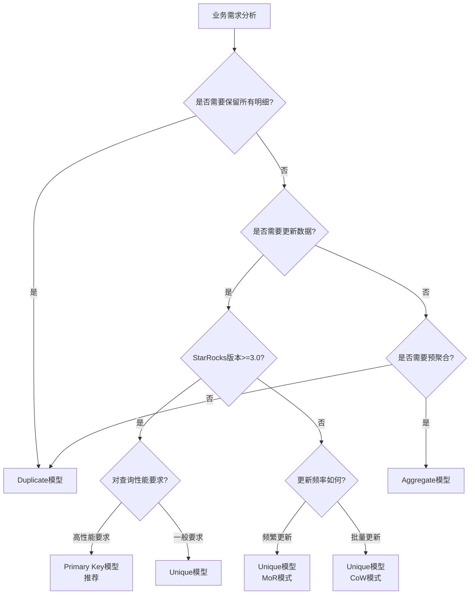

# StarRocks表模型详解

---

## 📖 导航

[🏠 返回主页](../../README.md) | [⬅️ 上一页](../02-quick-start/first-etl.md) | [➡️ 下一页](partition-strategy.md)

---

## 学习目标

- 理解StarRocks四种表模型的原理和特点
- 掌握不同场景下表模型的选择策略
- 学会根据业务需求设计合适的表结构
- 了解各模型的性能特征和优化要点
- 重点掌握Primary Key模型的优势和使用场景

## 表模型概述

StarRocks提供了四种表模型，每种模型针对不同的使用场景进行了优化：

| 模型类型 | 适用场景 | 数据特点 | 更新支持 | 版本要求 |
|---------|---------|---------|---------|---------|
| **Duplicate** | 明细数据、日志数据 | 保留全部原始记录 | 仅追加 | v1.0+ |
| **Aggregate** | 指标聚合、统计分析 | 预聚合计算 | 聚合更新 | v1.0+ |
| **Unique** | 维度表、主数据 | 主键唯一 | 支持更新/删除 | v1.0+ (MoR: v2.0+, CoW: v2.5+) |
| **Primary Key** | 实时更新、事务数据 | 主键唯一、高性能更新 | 完整UPSERT/DELETE | **v3.0+** 🔥推荐 |

## Duplicate模型

### 概念说明

Duplicate模型是最基础的表模型，它会**完整保留所有导入的数据记录**，不进行任何聚合或去重操作。这种模型最接近传统数据库的表结构。

### 适用场景

- 📊 **原始明细数据**：交易流水、操作日志、事件记录
- 📝 **日志分析**：需要保留每一条日志记录
- 🔍 **数据审计**：需要追溯每一次操作记录
- 📈 **时序数据**：IoT设备数据、监控指标明细

### 建表示例

```sql
-- 订单明细表（Duplicate模型）
CREATE TABLE IF NOT EXISTS orders_detail (
    order_id BIGINT NOT NULL COMMENT "订单ID",
    user_id BIGINT NOT NULL COMMENT "用户ID",
    product_id BIGINT NOT NULL COMMENT "产品ID",
    order_time DATETIME NOT NULL COMMENT "下单时间",
    quantity INT NOT NULL COMMENT "购买数量",
    price DECIMAL(10,2) NOT NULL COMMENT "单价",
    total_amount DECIMAL(10,2) NOT NULL COMMENT "总金额",
    status VARCHAR(20) NOT NULL COMMENT "订单状态",
    create_time DATETIME NOT NULL COMMENT "创建时间"
)
DUPLICATE KEY(order_id, user_id, order_time)
PARTITION BY RANGE(order_time) (
    PARTITION p20240101 VALUES [('2024-01-01'), ('2024-01-02')),
    PARTITION p20240102 VALUES [('2024-01-02'), ('2024-01-03')),
    PARTITION p20240103 VALUES [('2024-01-03'), ('2024-01-04'))
)
DISTRIBUTED BY HASH(order_id) BUCKETS 10
PROPERTIES (
    "replication_num" = "3",
    "storage_format" = "V2",
    "enable_persistent_index" = "false"
);

-- 导入数据示例
INSERT INTO orders_detail VALUES
(1001, 10001, 2001, '2024-01-01 10:00:00', 2, 99.50, 199.00, 'PAID', NOW()),
(1002, 10001, 2002, '2024-01-01 10:30:00', 1, 299.00, 299.00, 'PAID', NOW()),
(1003, 10002, 2001, '2024-01-01 11:00:00', 3, 99.50, 298.50, 'PENDING', NOW());

-- 查询示例：获取用户订单明细
SELECT * FROM orders_detail 
WHERE user_id = 10001 
  AND order_time >= '2024-01-01'
ORDER BY order_time DESC;
```

### 性能特点

#### 优势
- ✅ **写入性能高**：无需聚合计算，直接追加
- ✅ **查询灵活**：保留所有明细，支持任意维度分析
- ✅ **数据完整**：不丢失任何原始信息

#### 劣势
- ❌ **存储空间大**：保存全部明细数据
- ❌ **聚合查询慢**：需要实时计算聚合结果
- ❌ **不支持更新**：只能追加新数据

### 优化建议

1. **合理设置DUPLICATE KEY**
   - 选择查询频繁的列作为前缀
   - 按照查询模式设计列顺序
   
2. **分区策略**
   - 按时间分区，便于数据生命周期管理
   - 控制单分区数据量在1-10GB

3. **分桶优化**
   - 选择高基数列作为分桶键
   - 分桶数 = 数据量(GB) / 1

## Aggregate模型

### 概念说明

Aggregate模型在数据导入时会**按照指定的聚合键进行预聚合**，相同聚合键的数据会根据聚合函数进行合并。这种模型特别适合需要统计分析的场景。

### 聚合函数类型

| 函数类型 | 说明 | 适用场景 |
|---------|------|---------|
| **SUM** | 求和 | 销售额、数量累计 |
| **MAX** | 最大值 | 最新状态、最高值 |
| **MIN** | 最小值 | 最早时间、最低值 |
| **REPLACE** | 替换 | 维度属性更新 |
| **HLL_UNION** | 基数统计 | UV统计、去重计数 |
| **BITMAP_UNION** | 精确去重 | 用户去重、标签计算 |

### 建表示例

```sql
-- 销售汇总表（Aggregate模型）
CREATE TABLE IF NOT EXISTS sales_summary (
    date DATE NOT NULL COMMENT "统计日期",
    product_id BIGINT NOT NULL COMMENT "产品ID",
    city VARCHAR(50) NOT NULL COMMENT "城市",
    
    -- 聚合指标列
    total_amount SUM DECIMAL(15,2) DEFAULT "0" COMMENT "销售总额",
    order_count SUM BIGINT DEFAULT "0" COMMENT "订单数",
    max_price MAX DECIMAL(10,2) DEFAULT "0" COMMENT "最高单价",
    min_price MIN DECIMAL(10,2) DEFAULT "999999" COMMENT "最低单价",
    
    -- REPLACE列保留最新值
    last_update_time REPLACE DATETIME DEFAULT NOW() COMMENT "最后更新时间",
    product_name REPLACE VARCHAR(100) DEFAULT "" COMMENT "产品名称",
    
    -- HLL列用于UV统计
    user_count HLL HLL_UNION COMMENT "购买用户数（估算）",
    
    -- BITMAP列用于精确去重
    user_bitmap BITMAP BITMAP_UNION COMMENT "购买用户ID集合"
)
AGGREGATE KEY(date, product_id, city)
PARTITION BY RANGE(date) (
    PARTITION p202401 VALUES [('2024-01-01'), ('2024-02-01')),
    PARTITION p202402 VALUES [('2024-02-01'), ('2024-03-01')),
    PARTITION p202403 VALUES [('2024-03-01'), ('2024-04-01'))
)
DISTRIBUTED BY HASH(product_id) BUCKETS 10;

-- 导入数据（会自动聚合）
INSERT INTO sales_summary VALUES
('2024-01-01', 2001, '北京', 1000.00, 1, 100.00, 100.00, NOW(), '产品A', hll_hash(10001), to_bitmap(10001)),
('2024-01-01', 2001, '北京', 2000.00, 2, 150.00, 80.00, NOW(), '产品A', hll_hash(10002), to_bitmap(10002)),
('2024-01-01', 2001, '上海', 1500.00, 1, 120.00, 120.00, NOW(), '产品A', hll_hash(10003), to_bitmap(10003));

-- 查询示例：按城市统计销售情况
SELECT 
    city,
    SUM(total_amount) as total_sales,
    SUM(order_count) as total_orders,
    MAX(max_price) as highest_price,
    MIN(min_price) as lowest_price,
    HLL_UNION_AGG(user_count) as unique_users,
    BITMAP_UNION_COUNT(user_bitmap) as exact_unique_users
FROM sales_summary
WHERE date >= '2024-01-01' AND date < '2024-02-01'
GROUP BY city;
```

### 性能特点

#### 优势
- ✅ **聚合查询快**：数据已预聚合，查询时直接读取
- ✅ **存储空间小**：只保存聚合后的结果
- ✅ **实时统计**：导入时即完成聚合计算

#### 劣势
- ❌ **明细丢失**：无法查询原始明细数据
- ❌ **聚合固定**：只能按预定义的聚合方式
- ❌ **写入较慢**：需要进行聚合计算

### 优化建议

1. **聚合键设计**
   - 将查询条件频繁的维度作为聚合键
   - 聚合键顺序影响查询性能

2. **聚合函数选择**
   - SUM/MAX/MIN适合数值统计
   - REPLACE适合维度属性
   - HLL适合大数据量UV估算
   - BITMAP适合精确去重但数据量不能太大

3. **分区分桶**
   - 聚合表通常数据量较小，可以适当减少分桶数
   - 按时间分区便于增量更新

## Unique模型

### 概念说明

Unique模型提供**主键唯一性约束**，相同主键的数据会进行更新替换。这种模型类似于传统数据库中有主键的表，支持数据的更新和删除操作。

### 更新机制

StarRocks提供两种更新实现方式：

#### 1. Merge on Read (MoR) - 读时合并
- **原理**：写入时保存多个版本，查询时合并返回最新版本
- **特点**：写入快，查询慢
- **适用**：写多读少场景

#### 2. Copy on Write (CoW) - 写时合并
- **原理**：写入时直接更新数据，保持数据唯一性
- **特点**：写入慢，查询快
- **适用**：读多写少场景

### 建表示例

```sql
-- 用户维度表（Unique模型 - MoR）
CREATE TABLE IF NOT EXISTS dim_user (
    user_id BIGINT NOT NULL COMMENT "用户ID",
    username VARCHAR(50) NOT NULL COMMENT "用户名",
    email VARCHAR(100) COMMENT "邮箱",
    phone VARCHAR(20) COMMENT "手机号",
    age INT COMMENT "年龄",
    gender VARCHAR(10) COMMENT "性别",
    city VARCHAR(50) COMMENT "城市",
    register_time DATETIME NOT NULL COMMENT "注册时间",
    last_login_time DATETIME COMMENT "最后登录时间",
    status VARCHAR(20) DEFAULT "ACTIVE" COMMENT "用户状态",
    update_time DATETIME DEFAULT NOW() COMMENT "更新时间"
)
UNIQUE KEY(user_id)
DISTRIBUTED BY HASH(user_id) BUCKETS 10
PROPERTIES (
    "replication_num" = "3",
    "enable_unique_key_merge_on_write" = "false"  -- 使用MoR模式
);

-- 产品主数据表（Unique模型 - CoW）
CREATE TABLE IF NOT EXISTS dim_product (
    product_id BIGINT NOT NULL COMMENT "产品ID",
    product_name VARCHAR(200) NOT NULL COMMENT "产品名称",
    category VARCHAR(50) NOT NULL COMMENT "类别",
    brand VARCHAR(50) COMMENT "品牌",
    price DECIMAL(10,2) NOT NULL COMMENT "价格",
    cost DECIMAL(10,2) COMMENT "成本",
    status VARCHAR(20) DEFAULT "ON_SALE" COMMENT "状态",
    create_time DATETIME NOT NULL COMMENT "创建时间",
    update_time DATETIME DEFAULT NOW() COMMENT "更新时间"
)
UNIQUE KEY(product_id)
DISTRIBUTED BY HASH(product_id) BUCKETS 10
PROPERTIES (
    "replication_num" = "3",
    "enable_unique_key_merge_on_write" = "true"  -- 使用CoW模式
);

-- 插入和更新数据
-- 首次插入
INSERT INTO dim_user VALUES
(10001, 'alice', 'alice@email.com', '13800138001', 25, 'F', '北京', '2023-01-01', '2024-01-01', 'ACTIVE', NOW()),
(10002, 'bob', 'bob@email.com', '13800138002', 30, 'M', '上海', '2023-02-01', '2024-01-02', 'ACTIVE', NOW());

-- 更新数据（相同主键会覆盖）
INSERT INTO dim_user VALUES
(10001, 'alice_new', 'alice_new@email.com', '13800138001', 26, 'F', '深圳', '2023-01-01', '2024-01-03', 'ACTIVE', NOW());

-- 查询最新数据
SELECT * FROM dim_user WHERE user_id = 10001;

-- 删除操作（通过DELETE命令）
DELETE FROM dim_user WHERE user_id = 10002;
```

### 性能特点

#### MoR模式
- ✅ **写入性能高**：追加写入，延迟合并
- ❌ **查询性能低**：需要读时合并多版本
- ✅ **适合实时更新**：频繁更新场景

#### CoW模式
- ❌ **写入性能低**：写时需要合并
- ✅ **查询性能高**：数据已去重，直接读取
- ✅ **适合批量更新**：定期批量更新场景

### 优化建议

1. **模式选择**
   - 实时更新、写多读少 → MoR模式
   - 批量更新、读多写少 → CoW模式

2. **主键设计**
   - 选择业务唯一标识作为主键
   - 主键不宜过多，影响性能

3. **更新策略**
   - 尽量批量更新，减少小批次更新
   - 使用DELETE + INSERT代替UPDATE

## Primary Key模型（v3.0+新特性）

### 概念说明

Primary Key模型是StarRocks 3.0版本引入的**新一代主键表模型**，专为高性能实时更新场景设计。它采用**Delete+Insert策略**替代传统的Merge-on-Read，实现了查询性能的大幅提升。

### 核心优势

相比Unique模型，Primary Key模型具有以下优势：

| 特性 | Primary Key模型 | Unique模型 | 性能提升 | 支持版本 |
|------|----------------|-----------|---------|---------|
| **查询性能** | 直接读取最新数据 | 需要合并多版本 | 3-10倍 | v3.0+ |
| **更新策略** | Delete+Insert | Merge-on-Read/Copy-on-Write | 更高效 | v3.0+ |
| **主键索引** | 支持持久化到磁盘 | 仅内存索引 | 内存节省 | **v3.2+** |
| **排序键** | 支持独立定义 | 与主键绑定 | 更灵活 | v3.0+ |
| **部分更新** | 原生支持列模式/行模式 | 有限支持 | 更完善 | **v3.1+** |
| **条件更新** | 支持（如Greater） | 不支持 | 新功能 | **v3.1+** |
| **云原生索引** | 支持对象存储索引 | 不支持 | 成本优化 | **v3.3.2+** |

### 技术原理

#### Delete+Insert策略
```
写入流程：
1. 加载主键索引到内存
2. Delete操作：标记旧数据为删除（DelVector）
3. Insert操作：写入新数据到新文件
4. 更新主键索引指向新位置

查询流程：
1. 根据主键索引定位最新数据
2. 跳过DelVector中标记删除的数据
3. 直接返回结果，无需合并
```

### 建表示例

#### 1. 基础Primary Key表

```sql
-- 用户信息表（Primary Key模型）
CREATE TABLE IF NOT EXISTS users_pk (
    user_id BIGINT NOT NULL COMMENT "用户ID",
    username VARCHAR(50) NOT NULL COMMENT "用户名",
    email VARCHAR(100) COMMENT "邮箱",
    phone VARCHAR(20) COMMENT "手机号",
    age INT COMMENT "年龄",
    city VARCHAR(50) COMMENT "城市",
    score DECIMAL(10,2) COMMENT "积分",
    register_time DATETIME NOT NULL COMMENT "注册时间",
    last_login_time DATETIME COMMENT "最后登录时间",
    status TINYINT DEFAULT 1 COMMENT "状态：1-活跃，0-禁用"
)
PRIMARY KEY(user_id)  -- 使用PRIMARY KEY而非UNIQUE KEY
DISTRIBUTED BY HASH(user_id) BUCKETS 10
PROPERTIES (
    "replication_num" = "3",
    "enable_persistent_index" = "true"  -- 启用持久化索引
);
```

#### 2. 主键与排序键分离

```sql
-- 订单表（主键与排序键分离）
CREATE TABLE IF NOT EXISTS orders_pk (
    order_id BIGINT NOT NULL COMMENT "订单ID",
    user_id BIGINT NOT NULL COMMENT "用户ID",
    merchant_id INT NOT NULL COMMENT "商家ID",
    order_time DATETIME NOT NULL COMMENT "下单时间",
    product_id INT NOT NULL COMMENT "产品ID",
    amount DECIMAL(10,2) NOT NULL COMMENT "金额",
    status TINYINT NOT NULL COMMENT "订单状态"
)
PRIMARY KEY(order_id)  -- 主键：保证唯一性
PARTITION BY date_trunc('day', order_time)  -- 按天分区
DISTRIBUTED BY HASH(order_id) BUCKETS 20
ORDER BY(order_time, merchant_id)  -- 排序键：独立定义，优化查询
PROPERTIES (
    "replication_num" = "3",
    "enable_persistent_index" = "true"
);
```

#### 3. 云原生部署（v3.3.2+）

```sql
-- 云原生环境的Primary Key表
CREATE TABLE IF NOT EXISTS events_pk (
    event_id BIGINT NOT NULL,
    event_time DATETIME NOT NULL,
    user_id BIGINT NOT NULL,
    event_type VARCHAR(50) NOT NULL,
    event_data JSON
)
PRIMARY KEY(event_id)
DISTRIBUTED BY HASH(event_id) BUCKETS 32
PROPERTIES (
    "replication_num" = "3",
    "enable_persistent_index" = "true",
    "persistent_index_type" = "CLOUD_NATIVE"  -- 对象存储持久化
);
```

### 数据操作示例

#### 1. INSERT（插入或更新）

```sql
-- 首次插入
INSERT INTO users_pk VALUES
(1001, 'alice', 'alice@email.com', '13800138001', 25, '北京', 1000.00, '2024-01-01', NOW(), 1),
(1002, 'bob', 'bob@email.com', '13800138002', 30, '上海', 2000.00, '2024-01-02', NOW(), 1);

-- 更新数据（相同主键会自动更新）
INSERT INTO users_pk VALUES
(1001, 'alice_new', 'alice_new@email.com', '13900139001', 26, '深圳', 1500.00, '2024-01-01', NOW(), 1);

-- 批量UPSERT
INSERT INTO users_pk 
SELECT * FROM source_users
ON DUPLICATE KEY UPDATE;  -- v3.2+支持
```

#### 2. UPDATE（条件更新）

```sql
-- 直接更新
UPDATE users_pk 
SET score = score + 100,
    last_login_time = NOW()
WHERE user_id = 1001;

-- 条件更新（v3.1+）
UPDATE users_pk 
SET score = 5000
WHERE user_id = 1001 AND score < 5000;  -- Greater条件
```

#### 3. DELETE（删除数据）

```sql
-- 删除指定用户
DELETE FROM users_pk 
WHERE user_id = 1002;

-- 批量删除
DELETE FROM users_pk 
WHERE status = 0 AND last_login_time < '2023-01-01';
```

#### 4. 部分更新（Partial Update）

```sql
-- 创建支持部分更新的表
CREATE TABLE IF NOT EXISTS products_pk (
    product_id BIGINT NOT NULL,
    name VARCHAR(200) NOT NULL,
    price DECIMAL(10,2),
    stock INT,
    update_time DATETIME
)
PRIMARY KEY(product_id)
DISTRIBUTED BY HASH(product_id)
PROPERTIES (
    "replication_num" = "3",
    "enable_persistent_index" = "true"
);

-- 仅更新部分列（列模式）
INSERT INTO products_pk (product_id, price, update_time) 
VALUES (2001, 99.99, NOW())
ON DUPLICATE KEY UPDATE;

-- 使用Stream Load进行部分更新
curl --location-trusted -u root: \
    -H "partial_update:true" \
    -H "columns:product_id,stock,update_time" \
    -T update_stock.csv \
    http://fe_host:8030/api/db/products_pk/_stream_load
```

### 性能特点

#### 性能对比测试

| 测试场景 | Primary Key | Unique(MoR) | Unique(CoW) | 性能提升 |
|---------|------------|-------------|-------------|---------|
| **点查询**(主键) | 10ms | 50ms | 30ms | 5倍/3倍 |
| **范围查询** | 100ms | 500ms | 300ms | 5倍/3倍 |
| **批量更新**(10万行) | 5s | 15s | 25s | 3倍/5倍 |
| **实时更新**(QPS) | 10000 | 3000 | 1000 | 3倍/10倍 |
| **内存占用** | 低(持久化) | 高(全内存) | 中等 | 显著降低 |

### 最佳实践

#### 1. 主键设计原则
- 选择不可变的业务唯一标识作为主键
- 主键列数量控制在1-3个
- 避免使用频繁变化的列作为主键

#### 2. 索引持久化配置
```sql
-- 大数据量场景：启用持久化索引
PROPERTIES ("enable_persistent_index" = "true")

-- 小数据量场景：可以使用内存索引
PROPERTIES ("enable_persistent_index" = "false")
```

#### 3. 排序键优化
```sql
-- 根据查询模式设计排序键
ORDER BY(高频查询列, 范围查询列)

-- 示例：用户行为分析
ORDER BY(event_time, user_id)  -- 时间范围 + 用户过滤
```

#### 4. 分区策略
- 实时更新表建议按天或小时分区
- 分区键不必包含在主键中
- 支持表达式分区提高灵活性

### Primary Key vs Unique 选择指南

| 场景 | 推荐模型 | 原因 |
|------|---------|------|
| **实时交易系统** | Primary Key | 高频更新、低延迟查询 |
| **用户画像** | Primary Key | 部分列更新、实时特征 |
| **实时数仓** | Primary Key | 流式更新、查询性能 |
| **配置管理** | Unique(CoW) | 低频更新、全量更新 |
| **历史数据** | Unique(MoR) | 批量导入、很少更新 |

## Primary Key模型版本演进

### 各版本功能对比

| 功能特性 | v3.0 | v3.1 | v3.2 | v3.3 | v3.4+ |
|---------|------|------|------|------|-------|
| **基础Primary Key** | ✅ | ✅ | ✅ | ✅ | ✅ |
| **Delete+Insert策略** | ✅ | ✅ | ✅ | ✅ | ✅ |
| **部分更新Row模式** | ✅ | ✅ | ✅ | ✅ | ✅ |
| **部分更新Column模式** | ❌ | ✅ | ✅ | ✅ | ✅ |
| **条件更新(Greater)** | ❌ | ✅ | ✅ | ✅ | ✅ |
| **主键索引持久化** | ❌ | ❌ | ✅ | ✅ | ✅ |
| **云原生索引** | ❌ | ❌ | ❌ | ✅ (v3.3.2+) | ✅ |
| **共享存储集群支持** | ❌ | ✅ | ✅ | ✅ | ✅ |

### v3.0.0 - 基础版本
```sql
-- v3.0 基础Primary Key表
CREATE TABLE users_v30 (
    user_id BIGINT NOT NULL,
    name VARCHAR(100),
    age INT
)
PRIMARY KEY(user_id)
DISTRIBUTED BY HASH(user_id);
```

### v3.1.0 - 功能增强
```sql
-- v3.1 支持部分更新Column模式和条件更新
CREATE TABLE users_v31 (
    user_id BIGINT NOT NULL,
    name VARCHAR(100),
    score DECIMAL(10,2),
    update_time DATETIME
)
PRIMARY KEY(user_id)
DISTRIBUTED BY HASH(user_id);

-- 条件更新 (v3.1+)
UPDATE users_v31 
SET score = 1000
WHERE user_id = 1001 AND score < 1000;  -- Greater条件
```

### v3.2.0 - 索引持久化
```sql
-- v3.2 支持索引持久化，节省内存
CREATE TABLE users_v32 (
    user_id BIGINT NOT NULL,
    name VARCHAR(100),
    age INT
)
PRIMARY KEY(user_id)
DISTRIBUTED BY HASH(user_id)
PROPERTIES (
    "enable_persistent_index" = "true"  -- v3.2+ 新特性
);
```

### v3.3.2+ - 云原生索引
```sql
-- v3.3.2 支持云原生索引（存算分离架构）
CREATE TABLE users_cloud (
    user_id BIGINT NOT NULL,
    name VARCHAR(100),
    age INT
)
PRIMARY KEY(user_id)
DISTRIBUTED BY HASH(user_id)
PROPERTIES (
    "enable_persistent_index" = "true",
    "persistent_index_type" = "CLOUD_NATIVE"  -- v3.3.2+ 新特性
);
```

### 版本选择建议

| StarRocks版本 | 推荐场景 | 主要限制 |
|-------------|---------|---------|
| **v3.0** | 基础Primary Key需求 | 仅支持Row模式部分更新 |
| **v3.1** | 需要Column模式部分更新 | 索引仅支持内存存储 |
| **v3.2** | 大数据量Primary Key表 | 推荐版本，索引可持久化 |
| **v3.3.2+** | 存算分离架构 | 云原生索引，成本更低 |
| **v3.4+** | 生产环境 | 稳定性和性能最佳 |

### 注意事项

1. **版本要求**：Primary Key模型需要StarRocks 3.0+
2. **不支持修改主键**：主键一旦定义不能修改
3. **主键非空约束**：所有主键列必须为NOT NULL
4. **资源消耗**：相比Duplicate模型会有额外的索引开销
5. **升级兼容性**：
   - v3.0 → v3.1: 完全兼容
   - v3.1 → v3.2: 完全兼容，可启用索引持久化
   - v3.2 → v3.3.2: 可选择云原生索引
6. **索引持久化建议**：
   - 数据量 > 100GB：推荐启用 `enable_persistent_index = true`
   - 内存受限环境：必须启用索引持久化
   - 云环境：v3.3.2+可选择云原生索引

## 模型选择决策树



## 实战案例对比

### 案例1：电商订单系统

```sql
-- 订单流水表：使用Duplicate模型
-- 原因：需要保留每笔订单的完整信息，用于对账和审计
CREATE TABLE orders_flow (
    order_id BIGINT,
    user_id BIGINT,
    amount DECIMAL(10,2),
    order_time DATETIME
) DUPLICATE KEY(order_id, order_time);

-- 销售统计表：使用Aggregate模型
-- 原因：只关心统计结果，不需要明细
CREATE TABLE sales_stats (
    date DATE,
    product_id BIGINT,
    total_amount SUM DECIMAL(15,2),
    order_count SUM BIGINT
) AGGREGATE KEY(date, product_id);

-- 用户信息表：使用Unique模型
-- 原因：用户信息需要更新，保持最新状态
CREATE TABLE user_info (
    user_id BIGINT,
    username VARCHAR(50),
    phone VARCHAR(20),
    last_login DATETIME
) UNIQUE KEY(user_id);
```

### 案例2：日志分析系统

```sql
-- 原始日志表：使用Duplicate模型
-- 原因：需要保留所有日志记录
CREATE TABLE app_logs (
    log_time DATETIME,
    user_id BIGINT,
    action VARCHAR(50),
    params TEXT
) DUPLICATE KEY(log_time, user_id);

-- 日志统计表：使用Aggregate模型
-- 原因：统计各类操作的次数和用户数
CREATE TABLE log_summary (
    date DATE,
    action VARCHAR(50),
    pv SUM BIGINT,
    uv HLL HLL_UNION
) AGGREGATE KEY(date, action);
```

## 性能对比测试

| 测试场景 | Duplicate | Aggregate | Unique(MoR) | Unique(CoW) |
|---------|-----------|-----------|-------------|-------------|
| 批量导入(100万行) | 10s | 15s | 12s | 20s |
| 点查询 | 50ms | 30ms | 80ms | 40ms |
| 聚合查询 | 500ms | 100ms | 600ms | 400ms |
| 更新操作 | 不支持 | 部分支持 | 100ms | 200ms |
| 存储空间 | 1GB | 200MB | 1.2GB | 1GB |

## 常见问题

### Q1: 能否修改表模型？
**A**: 不能直接修改。需要创建新表，迁移数据。

### Q2: Aggregate模型能查询明细吗？
**A**: 不能。聚合后原始明细已丢失。如需明细，请使用Duplicate模型。

### Q3: Unique模型的主键能修改吗？
**A**: 不能修改主键值，但可以删除后重新插入。

### Q4: 如何选择MoR还是CoW？
**A**: 实时更新选MoR，批量更新选CoW。可通过设置`enable_unique_key_merge_on_write`切换。

## 小结

- **Duplicate模型**：适合保留原始明细，如日志、流水记录
- **Aggregate模型**：适合预聚合统计，如报表、指标分析  
- **Unique模型**：适合需要更新的主数据，如用户、产品维度表
- **Primary Key模型**：v3.0+新特性，适合高性能实时更新场景，是实时数仓的最佳选择

### 模型选择建议

| 版本 | 实时更新场景推荐 | 性能要求 |
|------|----------------|---------|
| **v3.0+** | 优先选择 Primary Key 模型 | 查询性能提升3-10倍 |
| **v2.x** | 使用 Unique 模型 | 兼容性更好 |

选择合适的表模型是StarRocks性能优化的第一步，需要根据业务特点、查询需求和版本情况综合考虑。

---

## 📖 导航

[🏠 返回主页](../../README.md) | [⬅️ 上一页](../02-quick-start/first-etl.md) | [➡️ 下一页](partition-strategy.md)

---