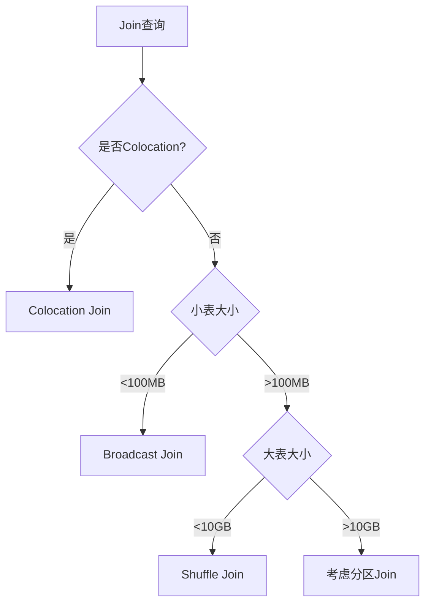

---
## 📖 导航
[🏠 返回主页](../../README.md) | [⬅️ 上一页](query-analysis.md) | [➡️ 下一页](aggregate-optimization.md)
---

# StarRocks Join优化技巧

> **版本要求**：本章节内容适用于StarRocks 2.0+，建议使用2.5+版本以获得最佳Join优化效果

## 学习目标

- 理解StarRocks中不同Join算法的特点和适用场景
- 掌握Broadcast Join、Shuffle Join和Colocation Join的使用
- 学会通过Hint和表设计优化Join性能
- 了解Runtime Filter对Join的加速作用

## Join算法类型

### 1. Join算法对比

> **版本演进**：Join算法在不同版本中的支持情况
> - Broadcast/Shuffle Join：StarRocks 1.19+
> - Colocation Join：StarRocks 2.0+
> - Bucket Shuffle Join：StarRocks 2.3+
> - Runtime Filter优化：StarRocks 2.5+

| Join类型 | 适用场景 | 数据移动 | 内存要求 | 性能特点 | 最低版本 |
|---------|---------|---------|---------|---------|----------|
| **Broadcast Join** | 大表Join小表 | 广播小表 | 中等 | 网络开销小，并行度高 | 1.19+ |
| **Shuffle Join** | 大表Join大表 | 双方Shuffle | 低 | 网络开销大，内存友好 | 1.19+ |
| **Colocation Join** | 本地Join | 无数据移动 | 低 | 性能最优，限制较多 | 2.0+ |
| **Bucket Shuffle Join** | 分桶表Join | 部分Shuffle | 中等 | 减少数据移动 | 2.3+ |
| **Broadcast Join** | 大表Join小表 | 广播小表 | 中等 | 网络开销小，并行度高 |
| **Shuffle Join** | 大表Join大表 | 双方Shuffle | 低 | 网络开销大，内存友好 |
| **Colocation Join** | 本地Join | 无数据移动 | 低 | 性能最优，限制较多 |
| **Bucket Shuffle Join** | 分桶表Join | 部分Shuffle | 中等 | 减少数据移动 |

### 2. Join算法选择逻辑



## Broadcast Join优化

### 1. 基本概念

Broadcast Join将小表广播到所有BE节点，与大表的本地数据进行Join，避免大表的数据移动。

```sql
-- 创建测试数据
USE demo_etl;

-- 大表：orders (100万行)
CREATE TABLE large_orders (
    order_id BIGINT,
    user_id BIGINT,
    product_id BIGINT,
    amount DECIMAL(10,2),
    order_date DATE
)
DUPLICATE KEY(order_id)
PARTITION BY RANGE(order_date) (
    PARTITION p202401 VALUES [('2024-01-01'), ('2024-02-01')),
    PARTITION p202402 VALUES [('2024-02-01'), ('2024-03-01'))
)
DISTRIBUTED BY HASH(order_id) BUCKETS 32;

-- 小表：products (1万行)  
CREATE TABLE products (
    product_id BIGINT,
    product_name VARCHAR(200),
    category VARCHAR(50),
    price DECIMAL(10,2)
)
DUPLICATE KEY(product_id)
DISTRIBUTED BY HASH(product_id) BUCKETS 10;
```

### 2. 自动Broadcast Join

```sql
-- StarRocks自动选择Broadcast Join
EXPLAIN 
SELECT 
    o.order_id,
    p.product_name,
    p.category,
    o.amount
FROM large_orders o
JOIN products p ON o.product_id = p.product_id
WHERE o.order_date = '2024-01-15';

/*
执行计划分析：
4:HASH JOIN
|  join op: INNER JOIN (BROADCAST)
|  colocate: false, reason: 
|  equal join conjunct: 3: product_id = 7: product_id
|  
|----3:EXCHANGE  -- 广播products表
|    |  
|    2:OlapScanNode
|       TABLE: products
|       
1:OlapScanNode
   TABLE: large_orders
   PREDICATES: 5: order_date = '2024-01-15'
*/
```

### 3. 强制Broadcast Join

```sql
-- 使用Hint强制Broadcast Join
SELECT /*+ BROADCAST(p) */
    o.order_id,
    p.product_name,
    o.amount
FROM large_orders o
JOIN products p ON o.product_id = p.product_id;

-- 设置Broadcast阈值
SET broadcast_row_limit = 1000000;  -- 100万行以下使用Broadcast
SET broadcast_right_table_scaling_factor = 1.0;
```

### 4. Broadcast Join性能调优

```sql
-- 优化Broadcast Join性能

-- 1. 减少广播表的数据量
SELECT /*+ BROADCAST(p) */
    o.order_id,
    p.product_name,
    o.amount
FROM large_orders o
JOIN (
    SELECT product_id, product_name 
    FROM products 
    WHERE category = 'Electronics'  -- 预过滤小表
) p ON o.product_id = p.product_id;

-- 2. 利用分区裁剪减少大表扫描
SELECT /*+ BROADCAST(p) */
    o.order_id,
    p.product_name,
    o.amount
FROM large_orders o
JOIN products p ON o.product_id = p.product_id
WHERE o.order_date BETWEEN '2024-01-01' AND '2024-01-31';  -- 分区过滤
```

## Shuffle Join优化

### 1. Shuffle Join场景

当两个表都比较大，无法使用Broadcast Join时，StarRocks会选择Shuffle Join。

```sql
-- 创建两个大表
CREATE TABLE large_users (
    user_id BIGINT,
    username VARCHAR(100),
    city VARCHAR(50),
    register_date DATE
)
DUPLICATE KEY(user_id)
DISTRIBUTED BY HASH(user_id) BUCKETS 32;

-- 大表Join大表，自动选择Shuffle Join
EXPLAIN 
SELECT 
    u.username,
    u.city,
    COUNT(*) as order_count,
    SUM(o.amount) as total_amount
FROM large_users u
JOIN large_orders o ON u.user_id = o.user_id
WHERE u.city IN ('北京', '上海', '深圳')
  AND o.order_date >= '2024-01-01'
GROUP BY u.user_id, u.username, u.city;

/*
执行计划分析：
6:HASH JOIN
|  join op: INNER JOIN (PARTITIONED)
|  colocate: false
|  equal join conjunct: 1: user_id = 5: user_id
|  
|----5:EXCHANGE  -- Shuffle orders表
|    |  partition exprs: 5: user_id
|    |  
|    1:OlapScanNode
|       TABLE: large_orders
|       
4:EXCHANGE  -- Shuffle users表
|  partition exprs: 1: user_id
|  
2:OlapScanNode
   TABLE: large_users
   PREDICATES: 3: city IN ('北京', '上海', '深圳')
*/
```

### 2. Shuffle Join优化策略

```sql
-- 1. 预过滤减少Shuffle数据量
SELECT 
    u.username,
    SUM(o.amount) as total_amount
FROM (
    SELECT user_id, username 
    FROM large_users 
    WHERE city = '北京' 
      AND register_date >= '2023-01-01'  -- 预过滤用户表
) u
JOIN (
    SELECT user_id, amount
    FROM large_orders 
    WHERE order_date >= '2024-01-01'
      AND amount > 100  -- 预过滤订单表
) o ON u.user_id = o.user_id
GROUP BY u.username;

-- 2. 调整Join顺序
-- 让过滤后数据量小的表作为右表
SELECT /*+ LEADING(o, u) */  -- 强制Join顺序
    u.username,
    COUNT(*) as order_count
FROM large_orders o
JOIN large_users u ON o.user_id = u.user_id
WHERE o.order_date = CURRENT_DATE  -- 当日订单数据较少
  AND o.status = 'PAID';
```

### 3. Bucket Shuffle Join

当Join的两个表使用相同的分桶键时，可以使用Bucket Shuffle Join减少数据移动。

```sql
-- 创建相同分桶键的表
CREATE TABLE orders_by_user (
    order_id BIGINT,
    user_id BIGINT,
    amount DECIMAL(10,2),
    order_date DATE
)
DUPLICATE KEY(order_id)
DISTRIBUTED BY HASH(user_id) BUCKETS 32;  -- 与用户表相同分桶

CREATE TABLE users_by_user (
    user_id BIGINT,
    username VARCHAR(100),
    city VARCHAR(50)
)
DUPLICATE KEY(user_id)  
DISTRIBUTED BY HASH(user_id) BUCKETS 32;  -- 相同分桶键和桶数

-- 执行Join会使用Bucket Shuffle
EXPLAIN 
SELECT u.username, COUNT(*) as order_count
FROM users_by_user u
JOIN orders_by_user o ON u.user_id = o.user_id
GROUP BY u.username;

-- 只需要对齐分桶的数据进行局部Shuffle，减少网络传输
```

## Colocation Join优化

> **版本要求**：Colocation Join需要StarRocks 2.0+
> - 基础Colocation：StarRocks 2.0+
> - 动态Colocation：StarRocks 2.5+
> - Colocation修复：StarRocks 3.0+

### 1. Colocation概念

Colocation Join通过将相关联的表数据物理存储在相同节点上，实现本地Join，避免任何数据移动。

```sql
-- 创建Colocation Group
CREATE TABLE users_colocate (
    user_id BIGINT,
    username VARCHAR(100),
    city VARCHAR(50)
)
DUPLICATE KEY(user_id)
DISTRIBUTED BY HASH(user_id) BUCKETS 32
PROPERTIES (
    "colocate_with" = "user_group",  -- 指定Colocation组
    "replication_num" = "3"
);

CREATE TABLE orders_colocate (
    order_id BIGINT,
    user_id BIGINT,
    amount DECIMAL(10,2),
    order_date DATE
)
DUPLICATE KEY(order_id, user_id)
DISTRIBUTED BY HASH(user_id) BUCKETS 32  -- 必须相同分桶键和桶数
PROPERTIES (
    "colocate_with" = "user_group",  -- 同一个Colocation组
    "replication_num" = "3"
);
```

### 2. Colocation Join使用

```sql
-- Colocation Join执行
EXPLAIN 
SELECT 
    u.username,
    COUNT(*) as order_count,
    SUM(o.amount) as total_amount
FROM users_colocate u
JOIN orders_colocate o ON u.user_id = o.user_id
WHERE u.city = '北京'
GROUP BY u.username;

/*
执行计划分析：
4:HASH JOIN
|  join op: INNER JOIN (COLOCATE)  -- 注意这里是COLOCATE
|  colocate: true
|  equal join conjunct: 1: user_id = 4: user_id
|  
|----1:OlapScanNode
|       TABLE: orders_colocate
|       
2:OlapScanNode
   TABLE: users_colocate
   PREDICATES: 3: city = '北京'

-- 没有EXCHANGE节点，表示没有数据移动
*/
```

### 3. Colocation管理

```sql
-- 查看Colocation状态
SHOW PROC '/colocation_group';

-- 查看表的Colocation状态
SHOW CREATE TABLE users_colocate;

-- 移除表的Colocation属性
ALTER TABLE users_colocate SET ("colocate_with" = "");

-- 修复Colocation Group（当数据分布不均时）
ALTER TABLE users_colocate SET ("colocate_with" = "user_group");
```

### 4. Colocation最佳实践

```sql
-- 1. 确保Join键和分桶键一致
-- ✅ 正确的设计
CREATE TABLE fact_sales (
    sale_id BIGINT,
    customer_id BIGINT,  -- Join键
    product_id BIGINT,
    amount DECIMAL(10,2)
)
DISTRIBUTED BY HASH(customer_id) BUCKETS 32  -- 分桶键与Join键一致
PROPERTIES ("colocate_with" = "customer_group");

CREATE TABLE dim_customer (
    customer_id BIGINT,  -- Join键
    customer_name VARCHAR(100),
    region VARCHAR(50)
)
DISTRIBUTED BY HASH(customer_id) BUCKETS 32  -- 相同分桶键
PROPERTIES ("colocate_with" = "customer_group");

-- 2. 定期检查Colocation状态
-- 创建监控脚本检查Colocation健康状态
SELECT 
    GroupId,
    GroupName,
    TableCount,
    BucketsNum,
    ReplicationNum,
    IsStable
FROM information_schema.colocation_groups 
WHERE IsStable = 'false';
```

## Runtime Filter优化

> **版本支持**：Runtime Filter功能的版本演进
> - Global Runtime Filter：StarRocks 2.5+
> - Local Runtime Filter：StarRocks 2.3+
> - MinMax Filter：StarRocks 2.5+
> - Bloom Filter：StarRocks 2.5+
> - IN Filter：StarRocks 3.0+
> - 自适应Filter：StarRocks 3.1+

### 1. Runtime Filter原理

Runtime Filter在Join执行过程中动态生成过滤条件，用于减少大表的扫描数据量。

```sql
-- 启用Runtime Filter（StarRocks 2.5+）
SET enable_global_runtime_filter = true;
SET runtime_filter_type = 12;  -- 启用Bloom Filter和MinMax Filter

-- Runtime Filter优化示例
EXPLAIN 
SELECT 
    o.order_id,
    o.amount,
    u.username
FROM large_orders o
JOIN users u ON o.user_id = u.user_id
WHERE u.city = '北京';  -- 小表过滤条件

/*
执行过程：
1. 扫描users表，过滤city='北京'的用户
2. 基于这些用户的user_id生成Runtime Filter
3. 将Runtime Filter推送到orders表的扫描中
4. orders表扫描时应用Runtime Filter，减少数据量
*/
```

### 2. Runtime Filter配置

```sql
-- 查看Runtime Filter相关参数
SHOW VARIABLES LIKE '%runtime_filter%';

-- 关键参数说明：
-- runtime_filter_mode: GLOBAL/LOCAL/OFF
-- runtime_filter_max_size: 最大Filter大小
-- runtime_filter_min_size: 最小Filter大小  
-- runtime_filter_type: Filter类型（Bloom/MinMax）
-- runtime_filter_wait_time_ms: 等待Filter生成的时间

-- 优化配置
SET runtime_filter_mode = 'GLOBAL';
SET runtime_filter_max_size = 16777216;  -- 16MB
SET runtime_filter_wait_time_ms = 1000;   -- 1秒
```

### 3. Runtime Filter效果验证

```sql
-- 验证Runtime Filter效果
-- 开启Profile观察Filter使用情况
SET enable_profile = true;

SELECT 
    o.order_id,
    u.username
FROM large_orders o
JOIN users u ON o.user_id = u.user_id
WHERE u.city = '北京'
  AND u.register_date >= '2023-01-01';

-- 在Profile中查看：
-- RuntimeFilter related:
--   - RuntimeFilterNum: 使用的Filter数量
--   - RuntimeFilterTime: Filter生成和应用时间
--   - RuntimeFilterRows: 被Filter过滤的行数
```

## Join性能调优实战案例

### 1. 复杂多表Join优化

```sql
-- 优化前：5表Join性能差
SELECT 
    u.username,
    p.product_name,
    c.category_name,
    r.region_name,
    SUM(o.amount) as total_sales
FROM users u
JOIN orders o ON u.user_id = o.user_id
JOIN products p ON o.product_id = p.product_id  
JOIN categories c ON p.category_id = c.category_id
JOIN regions r ON u.region_id = r.region_id
WHERE o.order_date >= '2024-01-01'
GROUP BY u.username, p.product_name, c.category_name, r.region_name;

-- 优化后：调整Join顺序和算法
SELECT /*+ LEADING(o, u, p, c, r) */  -- 指定Join顺序
    u.username,
    p.product_name,
    c.category_name,
    r.region_name,
    total_sales
FROM (
    -- 预聚合减少数据量
    SELECT 
        user_id, 
        product_id, 
        SUM(amount) as total_sales
    FROM orders 
    WHERE order_date >= '2024-01-01'
    GROUP BY user_id, product_id
) o
JOIN users u /*+ BROADCAST */ ON o.user_id = u.user_id
JOIN products p /*+ BROADCAST */ ON o.product_id = p.product_id
JOIN categories c /*+ BROADCAST */ ON p.category_id = c.category_id  
JOIN regions r /*+ BROADCAST */ ON u.region_id = r.region_id;
```

### 2. 分区Join优化

```sql
-- 利用分区键优化Join
-- orders表按日期分区，users表按注册日期分区
SELECT 
    u.username,
    COUNT(*) as same_day_orders
FROM users u
JOIN orders o ON u.user_id = o.user_id 
    AND u.register_date = o.order_date  -- 分区键Join，实现分区对分区Join
WHERE u.register_date = '2024-01-15';

-- 这种写法可以实现分区级别的本地Join，大大提升性能
```

### 3. Join条件优化

```sql
-- 优化前：函数导致无法使用索引
SELECT u.username, COUNT(*) 
FROM users u
JOIN orders o ON CAST(u.user_id AS VARCHAR) = CAST(o.user_id AS VARCHAR);

-- 优化后：直接Join，可以使用索引和分桶优化
SELECT u.username, COUNT(*)
FROM users u  
JOIN orders o ON u.user_id = o.user_id;

-- 优化前：范围Join效率低
SELECT u.username, o.amount
FROM users u
JOIN orders o ON u.user_id BETWEEN o.min_user_id AND o.max_user_id;

-- 优化后：等值Join + 预过滤
SELECT u.username, o.amount
FROM users u
JOIN (
    SELECT user_id, amount 
    FROM orders 
    WHERE user_id >= 1000 AND user_id <= 2000
) o ON u.user_id = o.user_id
WHERE u.user_id >= 1000 AND u.user_id <= 2000;
```

## Join性能监控

### 1. Join性能指标

```sql
-- 创建Join性能监控视图
CREATE VIEW join_performance AS
SELECT 
    query_id,
    user,
    sql_text,
    query_start_time,
    total_time_ms,
    scan_rows,
    scan_bytes,
    -- 识别包含Join的查询
    CASE 
        WHEN UPPER(sql_text) LIKE '%JOIN%' THEN 'JOIN'
        ELSE 'NON_JOIN'
    END as query_type,
    -- 分析Join复杂度
    CASE 
        WHEN UPPER(sql_text) LIKE '%JOIN%' THEN
            (LENGTH(sql_text) - LENGTH(REPLACE(UPPER(sql_text), 'JOIN', ''))) / 4
        ELSE 0
    END as join_count
FROM information_schema.query_log
WHERE query_start_time >= DATE_SUB(NOW(), INTERVAL 1 HOUR);

-- 查看Join查询性能分布
SELECT 
    join_count,
    COUNT(*) as query_count,
    AVG(total_time_ms) as avg_time_ms,
    MAX(total_time_ms) as max_time_ms,
    AVG(scan_rows) as avg_scan_rows
FROM join_performance 
WHERE query_type = 'JOIN'
GROUP BY join_count
ORDER BY join_count;
```

### 2. 自动化Join优化建议

```sql
-- Join优化建议生成器
WITH slow_joins AS (
    SELECT 
        query_id,
        sql_text,
        total_time_ms,
        scan_rows
    FROM information_schema.query_log
    WHERE UPPER(sql_text) LIKE '%JOIN%'
      AND total_time_ms > 10000  -- 超过10秒的Join查询
      AND query_start_time >= DATE_SUB(NOW(), INTERVAL 1 DAY)
)
SELECT 
    query_id,
    SUBSTR(sql_text, 1, 100) as sql_preview,
    total_time_ms,
    CASE 
        WHEN scan_rows > 10000000 THEN '建议：考虑分区裁剪和预过滤'
        WHEN sql_text LIKE '%CROSS JOIN%' THEN '建议：避免笛卡尔积Join'
        WHEN sql_text LIKE '%LEFT JOIN%' AND sql_text LIKE '%IS NULL%' THEN '建议：考虑使用NOT EXISTS'
        WHEN total_time_ms > 30000 THEN '建议：检查是否可以使用物化视图'
        ELSE '建议：分析执行计划，优化Join顺序'
    END as optimization_suggestion
FROM slow_joins
ORDER BY total_time_ms DESC
LIMIT 10;
```

## 版本特性对比

| Join优化特性 | v2.0 | v2.3 | v2.5 | v3.0 | v3.1+ |
|-------------|------|------|------|------|-------|
| **基础Join算法** | ✅ | ✅ | ✅ | ✅ | ✅ |
| **Colocation Join** | ✅ | ✅ | ✅ | ✅ | ✅ |
| **Bucket Shuffle** | ❌ | ✅ | ✅ | ✅ | ✅ |
| **Global Runtime Filter** | ❌ | ❌ | ✅ | ✅ | ✅ |
| **动态Colocation** | ❌ | ❌ | ✅ | ✅ | ✅ |
| **IN Runtime Filter** | ❌ | ❌ | ❌ | ✅ | ✅ |
| **自适应Join算法** | ❌ | ❌ | ❌ | ❌ | ✅ |

## 版本选择建议

- **StarRocks 2.0**：支持基础Join优化和Colocation Join
- **StarRocks 2.3+**：推荐版本，支持Bucket Shuffle Join
- **StarRocks 2.5+**：最佳选择，完整Runtime Filter支持
- **StarRocks 3.0+**：企业级部署，支持IN Filter和Colocation修复
- **StarRocks 3.1+**：最新特性，自适应Join算法优化

## 小结

StarRocks Join优化的关键要点：

### 1. Join算法选择
- **小表Join大表**：优先使用Broadcast Join
- **大表Join大表**：使用Shuffle Join，注意预过滤
- **相关表**：设计Colocation Join实现本地Join

### 2. 性能优化策略
- **预过滤**：在Join前减少数据量
- **分区裁剪**：利用分区键减少扫描范围  
- **Runtime Filter**：动态过滤大表数据（2.5+）
- **统计信息**：保持统计信息及时更新

### 3. 表设计考虑
- **分桶策略**：相关表使用相同分桶键
- **Colocation设计**：核心业务表考虑Colocation（2.0+）
- **分区设计**：支持分区级Join优化

掌握这些Join优化技巧，可以显著提升StarRocks的查询性能，特别是在处理复杂分析查询时。

---
## 📖 导航
[🏠 返回主页](../../README.md) | [⬅️ 上一页](query-analysis.md) | [➡️ 下一页](aggregate-optimization.md)
---