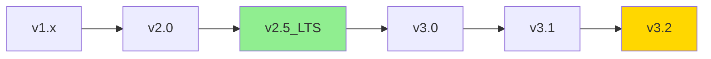

---
## 📖 导航
[🏠 返回主页](../README.md) | [⬅️ 上一页](07-best-practices/mysql-migration-best-practices.md) | [➡️ 下一页](../README.md)
---

# StarRocks版本特性对照表

## 版本概览

| 版本系列 | 发布时间 | 状态 | 支持周期 | 推荐场景 |
|---------|---------|------|---------|---------|
| v1.x | 2021-09 | EOL | 已停止支持 | 不推荐 |
| v2.0 | 2022-01 | 维护 | 2024-12 | 稳定生产 |
| v2.5 LTS | 2023-01 | LTS | 2025-12 | 长期支持 |
| v3.0 | 2023-06 | 活跃 | 2025-06 | 新特性 |
| v3.1 | 2023-09 | 活跃 | 2025-09 | 新特性 |
| v3.2 | 2024-01 | 活跃 | 2026-01 | 推荐使用 |
| v3.3 | 2024-05 | 活跃 | 2026-05 | 最新特性 |
| v3.4 | 2024-08 | 最新稳定 | 2026-08 | 生产推荐 |
| v3.5 | 2024-11 | 最新 | 2026-11 | 前沿特性 |

## 核心特性对比

### 数据类型支持

| 特性 | v1.x | v2.0 | v2.5 LTS | v3.0 | v3.1 | v3.2 | v3.3 | v3.4 | v3.5 |
|------|------|------|----------|------|------|------|------|------|------|
| **基础数值类型** | ✅ | ✅ | ✅ | ✅ | ✅ | ✅ | ✅ | ✅ | ✅ |
| **DECIMAL精度** | 27位 | 38位 | 38位 | 38位 | 38位 | 38位 | 38位 | 38位 | 38位 |
| **DECIMAL32/64/128** | ❌ | ❌ | ❌ | ✅ | ✅ | ✅ | ✅ | ✅ | ✅ |
| **JSON类型** | ❌ | ❌ | ✅ | ✅ | ✅ | ✅ | ✅ | ✅ | ✅ |
| **ARRAY类型** | ❌ | ✅ | ✅ | ✅ | ✅ | ✅ | ✅ | ✅ | ✅ |
| **MAP类型** | ❌ | ❌ | ❌ | ✅ | ✅ | ✅ | ✅ | ✅ | ✅ |
| **STRUCT类型** | ❌ | ❌ | ❌ | ❌ | ✅ | ✅ | ✅ | ✅ | ✅ |
| **BINARY/VARBINARY** | ❌ | ❌ | ✅ | ✅ | ✅ | ✅ | ✅ | ✅ | ✅ |
| **UUID类型** | ❌ | ❌ | ❌ | ❌ | ❌ | ❌ | ✅ | ✅ | ✅ |

### 字符串长度限制

| 类型限制 | v1.x | v2.0 | v2.5 LTS | v3.0 | v3.1 | v3.2 |
|---------|------|------|----------|------|------|------|
| **CHAR最大长度** | 255 | 255 | 255 | 1024 | 1024 | 1024 |
| **VARCHAR最大长度** | 65533 | 65533 | 65533 | 1048576 | 1048576 | 1048576 |
| **STRING最大长度** | 65533 | 65533 | 1MB | 2GB | 2GB | 2GB |
| **JSON最大大小** | - | - | 1MB | 2GB | 2GB | 2GB |

### 表模型特性

| 特性 | v1.x | v2.0 | v2.5 LTS | v3.0 | v3.1 | v3.2 | v3.3 | v3.4 | v3.5 |
|------|------|------|----------|------|------|------|------|------|------|
| **Duplicate模型** | ✅ | ✅ | ✅ | ✅ | ✅ | ✅ | ✅ | ✅ | ✅ |
| **Aggregate模型** | ✅ | ✅ | ✅ | ✅ | ✅ | ✅ | ✅ | ✅ | ✅ |
| **Unique模型** | ✅ | ✅ | ✅ | ✅ | ✅ | ✅ | ✅ | ✅ | ✅ |
| **Unique MoR** | ❌ | ✅ | ✅ | ✅ | ✅ | ✅ | ✅ | ✅ | ✅ |
| **Unique CoW** | ❌ | ❌ | ✅ | ✅ | ✅ | ✅ | ✅ | ✅ | ✅ |
| **Primary Key模型** | ❌ | ❌ | ❌ | ✅ | ✅ | ✅ | ✅ | ✅ | ✅ |
| **PK索引持久化** | ❌ | ❌ | ❌ | ❌ | ❌ | ✅ | ✅ | ✅ | ✅ |
| **PK云原生索引** | ❌ | ❌ | ❌ | ❌ | ❌ | ❌ | ✅ | ✅ | ✅ |
| **PK部分更新Column模式** | ❌ | ❌ | ❌ | ❌ | ✅ | ✅ | ✅ | ✅ | ✅ |
| **PK条件更新** | ❌ | ❌ | ❌ | ❌ | ✅ | ✅ | ✅ | ✅ | ✅ |

### 分区分桶特性

| 特性 | v1.x | v2.0 | v2.5 LTS | v3.0 | v3.1 | v3.2 |
|------|------|------|----------|------|------|------|
| **Range分区** | ✅ | ✅ | ✅ | ✅ | ✅ | ✅ |
| **List分区** | ❌ | ✅ | ✅ | ✅ | ✅ | ✅ |
| **动态分区** | ✅ | ✅ | ✅ | ✅ | ✅ | ✅ |
| **自动分区** | ❌ | ❌ | ❌ | ✅ | ✅ | ✅ |
| **分区表达式** | ❌ | ❌ | ❌ | ❌ | ✅ | ✅ |
| **最大分区数** | 1024 | 4096 | 4096 | 10000 | 10000 | 100000 |
| **最大分桶数** | 256 | 512 | 512 | 1024 | 1024 | 10000 |

### 索引特性

| 特性 | v1.x | v2.0 | v2.5 LTS | v3.0 | v3.1 | v3.2 |
|------|------|------|----------|------|------|------|
| **前缀索引** | ✅ | ✅ | ✅ | ✅ | ✅ | ✅ |
| **Bitmap索引** | ✅ | ✅ | ✅ | ✅ | ✅ | ✅ |
| **Bloom Filter** | ✅ | ✅ | ✅ | ✅ | ✅ | ✅ |
| **全局字典** | ❌ | ✅ | ✅ | ✅ | ✅ | ✅ |
| **倒排索引** | ❌ | ❌ | ❌ | ❌ | ✅ | ✅ |
| **N-gram索引** | ❌ | ❌ | ❌ | ❌ | ❌ | ✅ |

### 查询优化特性

| 特性 | v1.x | v2.0 | v2.5 LTS | v3.0 | v3.1 | v3.2 |
|------|------|------|----------|------|------|------|
| **CBO优化器** | 基础 | 改进 | 增强 | 全新 | 优化 | 优化 |
| **Runtime Filter** | ❌ | ✅ | ✅ | ✅ | ✅ | ✅ |
| **Join Reorder** | ❌ | ✅ | ✅ | ✅ | ✅ | ✅ |
| **物化视图** | ✅ | ✅ | ✅ | ✅ | ✅ | ✅ |
| **异步物化视图** | ❌ | ❌ | ✅ | ✅ | ✅ | ✅ |
| **查询缓存** | ❌ | ❌ | ✅ | ✅ | ✅ | ✅ |
| **并行度自适应** | ❌ | ❌ | ❌ | ✅ | ✅ | ✅ |

### 导入导出特性

| 特性 | v1.x | v2.0 | v2.5 LTS | v3.0 | v3.1 | v3.2 |
|------|------|------|----------|------|------|------|
| **Stream Load** | ✅ | ✅ | ✅ | ✅ | ✅ | ✅ |
| **Broker Load** | ✅ | ✅ | ✅ | ✅ | ✅ | ✅ |
| **Routine Load** | ✅ | ✅ | ✅ | ✅ | ✅ | ✅ |
| **Spark Load** | ✅ | ✅ | 废弃 | 移除 | - | - |
| **INSERT INTO** | ✅ | ✅ | ✅ | ✅ | ✅ | ✅ |
| **导出到文件** | ❌ | ✅ | ✅ | ✅ | ✅ | ✅ |
| **Stream Load事务** | ❌ | 部分 | ✅ | ✅ | ✅ | ✅ |
| **SQL事务** | ❌ | ❌ | ❌ | ❌ | ❌ | 部分 |

### 物化视图特性

| 特性 | v1.x | v2.0 | v2.5 LTS | v3.0 | v3.1 | v3.2 | v3.3 | v3.4 | v3.5 |
|------|------|------|----------|------|------|------|------|------|------|
| **同步物化视图** | ✅ | ✅ | ✅ | ✅ | ✅ | ✅ | ✅ | ✅ | ✅ |
| **异步物化视图** | ❌ | ❌ | ✅ | ✅ | ✅ | ✅ | ✅ | ✅ | ✅ |
| **多表JOIN物化视图** | ❌ | ❌ | ❌ | ❌ | ❌ | ❌ | ✅ | ✅ | ✅ |
| **外部表物化视图(Hive)** | ❌ | ❌ | ✅ | ✅ | ✅ | ✅ | ✅ | ✅ | ✅ |
| **外部表物化视图(Iceberg)** | ❌ | ❌ | ❌ | ✅ | ✅ | ✅ | ✅ | ✅ | ✅ |
| **外部表物化视图(Hudi)** | ❌ | ❌ | ❌ | ❌ | ❌ | ✅ | ✅ | ✅ | ✅ |
| **外部表物化视图(Paimon)** | ❌ | ❌ | ❌ | ❌ | ❌ | ✅ | ✅ | ✅ | ✅ |
| **分区级增量刷新** | ❌ | ❌ | ❌ | ❌ | ✅ | ✅ | ✅ | ✅ | ✅ |
| **多分区列支持** | ❌ | ❌ | ❌ | ❌ | ❌ | ❌ | ❌ | ❌ | ✅ |
| **强制查询改写** | ❌ | ❌ | ❌ | ❌ | ❌ | ❌ | ❌ | ❌ | ✅ |
| **时序维度表支持** | ❌ | ❌ | ❌ | ❌ | ❌ | ❌ | ✅ | ✅ | ✅ |
| **List分区表支持** | ❌ | ❌ | ❌ | ❌ | ❌ | ❌ | ✅ | ✅ | ✅ |

### 事务功能演进

| 特性 | v1.x | v2.0 | v2.1 | v2.4 | v2.5 LTS | v3.0 | v3.1 | v3.2 | v3.3 | v3.4 | v3.5 |
|------|------|------|------|------|----------|------|------|------|------|------|------|
| **单表ACID** | ✅ | ✅ | ✅ | ✅ | ✅ | ✅ | ✅ | ✅ | ✅ | ✅ | ✅ |
| **Stream Load事务** | ❌ | ❌ | ❌ | ✅ | ✅ | ✅ | ✅ | ✅ | ✅ | ✅ | ✅ |
| **2PC支持** | ❌ | ❌ | ❌ | ✅ | ✅ | ✅ | ✅ | ✅ | ✅ | ✅ | ✅ |
| **事务标签管理** | ❌ | ❌ | ❌ | ✅ | ✅ | ✅ | ✅ | ✅ | ✅ | ✅ | ✅ |
| **Routine Load一致性** | 基础 | 基础 | 基础 | ✅ | ✅ | ✅ | ✅ | ✅ | ✅ | ✅ | ✅ |
| **SQL事务(Beta)** | ❌ | ❌ | ❌ | ❌ | ❌ | ❌ | ❌ | ❌ | ❌ | ❌ | ✅ |
| **BEGIN/COMMIT语法** | ❌ | ❌ | ❌ | ❌ | ❌ | ❌ | ❌ | ❌ | ❌ | ❌ | ✅ |
| **事务内可见性** | - | - | - | - | - | - | - | - | - | - | ❌ |
| **跨会话SYNC** | ✅ | ✅ | ✅ | ✅ | ✅ | ✅ | ✅ | ✅ | ✅ | ✅ | ✅ |

#### 事务支持程度说明

| 版本范围 | 事务能力 | 支持场景 | 限制说明 |
|---------|---------|----------|----------|
| **v1.x - v2.3** | 存储引擎ACID | 单次导入操作 | 仅保证单表单次操作的原子性 |
| **v2.4 - v3.4** | Stream Load事务 | 高并发数据导入 | 支持2PC，确保导入数据一致性 |
| **v3.5+** | SQL事务(Beta) | 多表批量操作 | 有限ACID，不支持事务内可见性 |

#### 关键版本节点

- **v2.4.0** (2022-12): 首次引入Stream Load事务支持，支持2PC协议
- **v2.5.0** (2023-01): Stream Load事务功能稳定，支持事务标签管理
- **v3.5.0** (2024-11): 引入SQL事务功能(Beta版)，支持BEGIN WORK/COMMIT语法

### 生态集成

| 特性 | v1.x | v2.0 | v2.5 LTS | v3.0 | v3.1 | v3.2 | v3.3 | v3.4 | v3.5 |
|------|------|------|----------|------|------|------|------|------|------|
| **MySQL协议** | ✅ | ✅ | ✅ | ✅ | ✅ | ✅ | ✅ | ✅ | ✅ |
| **Hive外表** | ✅ | ✅ | ✅ | ✅ | ✅ | ✅ | ✅ | ✅ | ✅ |
| **Iceberg** | ❌ | ❌ | ✅ | ✅ | ✅ | ✅ | ✅ | ✅ | ✅ |
| **Hudi** | ❌ | ❌ | ✅ | ✅ | ✅ | ✅ | ✅ | ✅ | ✅ |
| **Delta Lake** | ❌ | ❌ | ❌ | ✅ | ✅ | ✅ | ✅ | ✅ | ✅ |
| **Paimon** | ❌ | ❌ | ❌ | ❌ | ❌ | ❌ | ✅ | ✅ | ✅ |
| **JDBC外表** | ❌ | ✅ | ✅ | ✅ | ✅ | ✅ | ✅ | ✅ | ✅ |
| **PostgreSQL支持** | ❌ | ❌ | ✅ | ✅ | ✅ | ✅ | ✅ | ✅ | ✅ |
| **Oracle JDBC** | ❌ | ❌ | ❌ | ❌ | ❌ | ❌ | ✅ | ✅ | ✅ |
| **Elasticsearch** | ❌ | ✅ | ✅ | ✅ | ✅ | ✅ | ✅ | ✅ | ✅ |
| **Kafka连接器** | ✅ | ✅ | ✅ | ✅ | ✅ | ✅ | ✅ | ✅ | ✅ |
| **Flink CDC** | ❌ | ✅ | ✅ | ✅ | ✅ | ✅ | ✅ | ✅ | ✅ |

## 性能对比

### 查询性能提升（相对v1.x基准）

| 场景 | v2.0 | v2.5 LTS | v3.0 | v3.1 | v3.2 |
|------|------|----------|------|------|------|
| **单表查询** | 120% | 150% | 200% | 220% | 250% |
| **多表Join** | 130% | 180% | 300% | 350% | 400% |
| **聚合查询** | 110% | 140% | 180% | 200% | 230% |
| **窗口函数** | 100% | 120% | 200% | 250% | 280% |

### 导入性能提升（相对v1.x基准）

| 场景 | v2.0 | v2.5 LTS | v3.0 | v3.1 | v3.2 |
|------|------|----------|------|------|------|
| **Stream Load** | 110% | 130% | 150% | 160% | 180% |
| **INSERT INTO** | 100% | 120% | 200% | 220% | 250% |
| **批量更新** | - | 100% | 300% | 400% | 500% |

## 重要限制变化

### 系统限制

| 限制项 | v1.x | v2.0 | v2.5 LTS | v3.0 | v3.1 | v3.2 |
|-------|------|------|----------|------|------|------|
| **单表最大列数** | 500 | 1000 | 1000 | 2000 | 3000 | 5000 |
| **单查询最大表数** | 20 | 50 | 50 | 100 | 200 | 500 |
| **SQL最大长度** | 64KB | 256KB | 256KB | 1MB | 1MB | 10MB |
| **IN列表最大项** | 1000 | 10000 | 10000 | 100000 | 100000 | 1000000 |

### 数据限制

| 限制项 | v1.x | v2.0 | v2.5 LTS | v3.0 | v3.1 | v3.2 |
|-------|------|------|----------|------|------|------|
| **单行最大大小** | 2MB | 2MB | 10MB | 100MB | 100MB | 1GB |
| **String最大长度** | 64KB | 64KB | 1MB | 2GB | 2GB | 2GB |
| **Array最大元素** | - | 10000 | 65535 | 1000000 | 1000000 | 无限制 |

## 版本升级路径

### 推荐升级路径

### 升级注意事项

#### v1.x → v2.x
- ⚠️ 表结构可能需要重建
- ⚠️ 部分SQL语法变化
- ⚠️ 配置参数调整

#### v2.x → v3.0
- ✅ 大部分兼容
- ⚠️ 字符串长度限制放宽，需检查
- ⚠️ 新的DECIMAL类型性能更好

#### v3.0 → v3.1/3.2
- ✅ 完全兼容
- ✅ 性能自动提升
- ✅ 新特性可选使用

## 版本选择建议

### 生产环境

| 场景 | 推荐版本 | 理由 |
|------|---------|------|
| **保守稳定** | v2.5 LTS | 长期支持，bug修复及时 |
| **性能优先** | v3.2 | 最新优化，性能最佳 |
| **功能需求** | v3.1+ | 支持STRUCT等新特性 |
| **小数据量** | v2.5 LTS | 稳定够用 |
| **大数据量** | v3.2 | 更好的扩展性 |

### 开发测试

- 建议直接使用最新版本v3.2
- 可以体验最新特性
- 为未来升级做准备

## 已知问题和限制

### v2.5 LTS已知问题
1. JSON嵌套深度限制100层
2. 动态分区偶尔延迟创建
3. 物化视图刷新可能失败

### v3.0已知问题
1. 部分场景下CBO选择次优计划
2. 超大IN列表可能OOM
3. 复杂嵌套查询性能退化

### v3.1/3.2已知问题
1. STRUCT类型不支持所有函数
2. 倒排索引占用额外存储
3. 自动分区可能创建过多分区

## 功能废弃时间表

| 功能 | 废弃版本 | 移除版本 | 替代方案 |
|------|---------|---------|---------|
| Spark Load | v2.5 | v3.0 | Broker Load |
| 旧版Unique表 | v3.0 | v4.0 | Primary Key表 |
| MySQL外表 | v3.1 | v4.0 | JDBC外表 |
| 旧版物化视图语法 | v3.0 | v3.5 | 新版异步物化视图 |

## 版本兼容性矩阵

### 客户端兼容性

| 客户端 | v2.0 | v2.5 | v3.0 | v3.1 | v3.2 |
|--------|------|------|------|------|------|
| MySQL 5.7客户端 | ✅ | ✅ | ✅ | ✅ | ✅ |
| MySQL 8.0客户端 | ✅ | ✅ | ✅ | ✅ | ✅ |
| JDBC驱动 | ✅ | ✅ | ✅ | ✅ | ✅ |
| ODBC驱动 | ✅ | ✅ | ✅ | ✅ | ✅ |

### 工具兼容性

| 工具 | v2.0 | v2.5 | v3.0 | v3.1 | v3.2 |
|------|------|------|------|------|------|
| Kettle 9.x | ✅ | ✅ | ✅ | ✅ | ✅ |
| DataX | ✅ | ✅ | ✅ | ✅ | ✅ |
| DBeaver | ✅ | ✅ | ✅ | ✅ | ✅ |
| Tableau | ⚠️ | ✅ | ✅ | ✅ | ✅ |

## 各版本重要特性介绍

### StarRocks 3.3 (2024-05)
- **支持多事实表物化视图**：v3.3+支持创建基于多个事实表JOIN的物化视图
- **List分区表物化视图**：支持在List分区表上创建异步物化视图
- **时序维度表支持**：支持基于时间维度表的物化视图自动刷新
- **Oracle JDBC支持**：新增Oracle数据库的JDBC外表和物化视图支持
- **Paimon集成**：支持Apache Paimon数据湖格式

### StarRocks 3.4 (2024-08)
- **性能优化**：查询引擎和存储层全面优化
- **稳定性增强**：生产环境稳定性大幅提升
- **Time Travel**：Iceberg Time Travel功能支持(v3.4.0+)
- **元数据表**：Iceberg元数据表支持(v3.4.1+)
- **Deletion Vector**：Delta Lake Deletion Vector支持(v3.4.1+)

### StarRocks 3.5 (2024-11)
- **多分区列物化视图**：支持使用多个分区列的物化视图
- **强制查询改写**：`query_rewrite_consistency=force_mv`确保使用物化视图
- **分区管理增强**：
  - 表达式分区合并：基于时间函数合并分区
  - TTL支持：List分区表和物化视图TTL管理
  - 批量分区删除：基于表达式批量删除分区

## Primary Key模型版本演进

| 版本 | 新增特性 | 说明 |
|------|---------|------|
| **v3.0.0** | Primary Key基础支持 | Delete+Insert策略，查询性能大幅提升 |
| **v3.1.0** | 部分更新Column模式 | 支持按列进行部分更新，减少网络传输 |
| **v3.1.0** | 条件更新支持 | 支持Greater等条件更新操作 |
| **v3.2.0** | 索引持久化 | 主键索引可持久化到磁盘，节省内存 |
| **v3.3.2** | 云原生索引 | 支持对象存储的云原生索引 |

## 物化视图功能成熟度

### 稳定可用（生产推荐）
- **Hive物化视图**: v2.5.13+, v3.0.6+, v3.1.5+, v3.2+
- **Iceberg物化视图**: v3.1.5+, v3.2+
- **异步物化视图**: v2.5+全面支持

### 预览版本（测试环境）
- **Hudi物化视图**: v3.2+ (不稳定)
- **Paimon物化视图**: v2.5.4+, v3.0+ (不稳定)
- **DeltaLake物化视图**: v3.2+ (不稳定)

## 连接器版本兼容性

### Flink连接器
- **最新版本**: 1.2.11 (支持Flink 1.15-1.20)
- **StarRocks要求**: 2.1及以上版本
- **Java版本**: 8
- **Scala版本**: 2.11, 2.12

### Spark连接器
- **最新版本**: 1.1.2 (支持Spark 3.2-3.5)
- **StarRocks要求**: 2.5及以上版本
- **Java版本**: 8
- **Scala版本**: 2.12

### Kafka连接器
- **最新版本**: 1.0.4 (支持Kafka 3.4)
- **StarRocks要求**: 2.5及以上版本
- **Java版本**: 8

## 总结

- **v2.5 LTS**：稳定生产，长期支持，适合保守场景
- **v3.0**：重大升级，性能飞跃，Primary Key模型首次亮相
- **v3.1**：功能增强，引入STRUCT，部分更新完善
- **v3.2**：推荐版本，索引持久化，生产就绪
- **v3.3**：多表物化视图，数据湖集成增强
- **v3.4**：稳定性优化，生产环境推荐
- **v3.5**：前沿特性，分区管理增强，物化视图功能完善

### 版本选择建议

| 使用场景 | 推荐版本 | 理由 |
|---------|---------|------|
| **传统数仓迁移** | v3.2+ | Primary Key + 索引持久化 |
| **实时数仓** | v3.4+ | 最佳稳定性和性能 |
| **数据湖分析** | v3.3+ | 完善的外部表物化视图支持 |
| **保守生产** | v2.5 LTS | 长期支持，风险最低 |
| **新项目试点** | v3.5 | 体验最新特性 |
| **需要事务支持** | v2.5+ | Stream Load事务稳定可用 |
| **需要SQL事务** | v3.5+ | SQL事务Beta版，谨慎使用 |
| **ETL密集型** | v2.5+ | Stream Load事务保证数据一致性 |

选择版本时需要权衡稳定性、性能和功能需求。建议优先考虑业务稳定性，然后根据特性需求选择合适版本。

---
## 📖 导航
[🏠 返回主页](../README.md) | [⬅️ 上一页](07-best-practices/mysql-migration-best-practices.md) | [➡️ 下一页](../README.md)
---